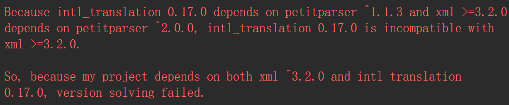
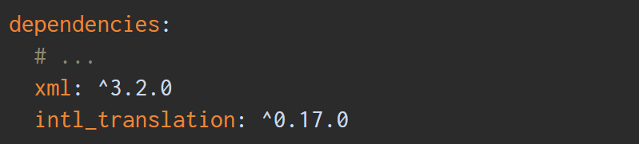
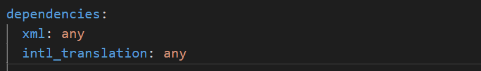
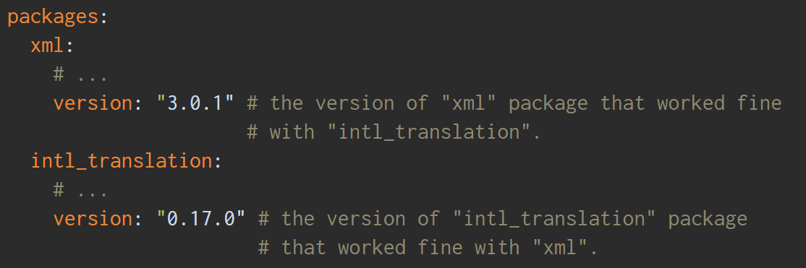

## 前言
flutter作为谷歌新推的跨平台的开发框架，有很大的发展前景。我主要归纳一些我在开发过程中遇到的难点,持续更新中...
## flutter卡在package get的解决方案
主要的问题是国内有墙，需要一些国内的镜像才可以下载到相应的包。我们可以给我们的电脑增加如下的环境变量：  
* Linux或Mac
```
export PUB_HOSTED_URL=https://pub.flutter-io.cn

export FLUTTER_STORAGE_BASE_URL=https://storage.flutter-io.cn
```
* Windows
```
PUB_HOSTED_URL ===== https://pub.flutter-io.cn

FLUTTER_STORAGE_BASE_URL ===== https://storage.flutter-io.cn
```

然后在终端运行` flutter doctor `命令，后续的` package get` 应该就没问题了

## Flutter报错Waiting for another flutter command to release the startup lock解决方案

解决方案： 打开`flutter`**安装目录** `/bin/cache`，找到`lockfile`文件，把这个文件删除，问题就解决了

## flutter中package包版本冲突的问题
当你的项目需要安装的依赖包越多，遇到包冲突可能性就越大，尤其是当依赖的包有重大更新时


上面可以看到是`xml`跟`intl_translation`两个包有冲突，因为他们依赖两个不同的`petitparser`包。打开`pubspec.yaml`看到:


解决办法：  
通过将两者依赖包版本号改为：any

击`flutter packages get`重新获取包，这样就会自动去匹配适合两者的包，然后我们会看到`Got dependencies`的结果，但是，问题还没有解决，我们需要在根目录下找到`pubspec.lock.yarm`文件，然后看到冲突的那两个包对应的版本号，这是通过匹配得到的适配的版本号，然后把在`pubspec.yaml`中的`any`改成对应的版本，就可以了。


