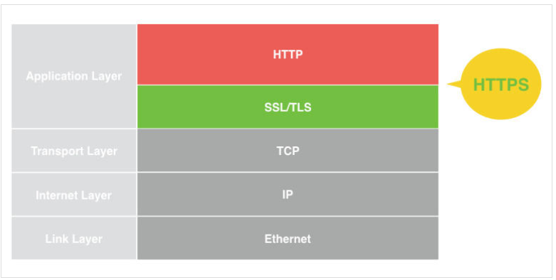
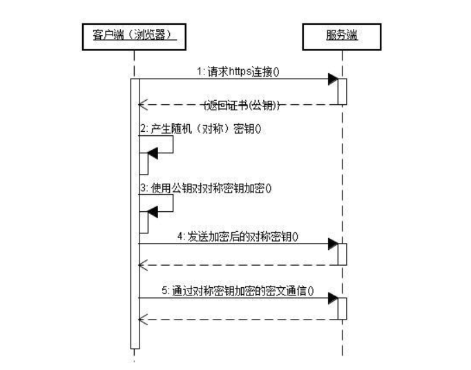
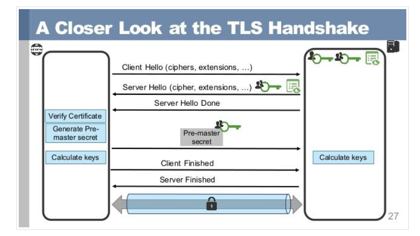

## 前言
纯面试需要而总结
## HTTPS和HTTP的区别主要如下
* `https`协议需要到ca申请证书，一般免费证书较少，因而需要一定费用。(但是现在在阿里云和腾讯云都可以免费从`HTTP`转`HTTPS`。会有免费的CA证书给你下载，时效为一年)
* http是**超文本传输协议**，信息是**明文传输**，https则是具有安全性的**SSL加密传输协议。**
* `http`和`https`使用的是完全不同的连接方式，用的端口也不一样，前者是`80`，后者是`443`。
* `http`的连接很简单，是**无状态的**；`HTTPS`协议是由`SSL+HTTP协议`构建的可进行**加密传输、身份认证的网络协议**，比`http`协议安全。  
由此可以对比得到，`http`协议是明文传输，**不确认通信方**，**不保证传输数据完整**的协议。它带来了三大风险：
* 窃听风险（eavesdropping）：第三方可以获知通信内容。
* 篡改风险（tampering）：第三方可以修改通信内容。
* 冒充风险（pretending）：第三方可以冒充他人身份参与通信。  
用一幅图更好的理解两种协议：

## 关于HTTP和HTTPS的基本概念
**HTTP :**是互联网上应用最为广泛的一种网络协议，是一个客户端和服务器端请求和应答的标准`（TCP）`，用于从`WWW服务器`传输超文本到本地浏览器的传输协议，它可以使浏览器更加高效，使网络传输减少。  
**HTTPS：**是以安全为目标的HTTP通道，简单讲是`HTTP`的安全版，即`HTTP`下加入`SSL层`，`HTTPS的安全基础是SSL`，因此加密的详细内容就需要`SSL`。  

HTTPS协议的主要作用可以分为两种：
* 一种是建立一个信息安全通道，来保证数据传输的安全
* 另一种就是确认网站的真实性。

### HTTP特点
* 支持客户/服务器模式。（C/S模式）
* 简单快速：客户向服务器请求服务时，只需传送请求方法和路径。请求方法常用的有`GET、HEAD、POST。`每种方法规定了客户与服务器联系的类型不同。由于`HTTP`协议简单，使得`HTTP`服务器的程序规模小，因而通信速度很快。
* 灵活：`HTTP`允许传输**任意类型的数据对象**。正在传输的类型由Content-Type加以标记。
* 无连接：无连接的含义是**限制每次连接只处理一个请求。服务器处理完客户的请求，并收到客户的应答后，即断开连接**。采用这种方式可以节省传输时间。
* 无状态：**HTTP协议是无状态协议**。无状态是指协议对于**事务处理没有记忆能力**。缺少状态意味着如果后续处理需要前面的信息，则它必须`重传`，这样可能导致每次连接传送的数据量增大。另一方面，在服务器不需要先前信息时它的应答就较快
### HTTPS特点
相比于http，https可以提供更加优质保密的信息，保证了**用户数据的安全性**，此外https同时也一定程度上保护了服务端，使用恶意攻击和伪装数据的成本大大提高。
## HTTP协议和HTTPS协议的工作过程
### HTTP协议的工作流程
第一步：建立TCP/IP连接，客户端与服务器通过Socket三次握手进行连接

第二步：客户端向服务端发起HTTP请求（例如：POST/login.html http/1.1）

第三步：客户端发送请求头信息，请求内容，最后会发送一空白行，标示客户端请求完毕

第四步：服务器做出应答，表示对于客户端请求的应答，例如：HTTP/1.1 200 OK

第五步：服务器向客户端发送应答头信息

第六步：服务器向客户端发送应答头信息后，也会发送一空白行，标示应答头信息发送完毕，接着就以Content-type要求的数据格式发送数据给客户端

第七步：服务端关闭TCP连接，如果服务器或者客户端增Connection:keep-alive就表示客户端与服务器端继续保存连接，在下次请求时可以继续使用这次的连接
### HTTPS工作流程

第一步：客户使用https的URL访问Web服务器，要求与Web服务器建立SSL连接。

第二步：Web服务器收到客户端请求后，会将网站的证书信息（证书中包含公钥）传送一份给客户端。

第三步：客户端的浏览器与Web服务器开始协商SSL连接的安全等级，也就是信息加密的等级。

第四步：客户端的浏览器根据双方同意的安全等级，建立会话密钥，然后利用网站的公钥将会话密钥加密，并传送给网站。

第五步：Web服务器利用自己的私钥解密出会话密钥。

第六步：Web服务器利用会话密钥加密与客户端之间的通信。
### SSL/TLS握手过程
现在我们具体关注在SSL连接是怎么样建立的
  
**Client Hello**  
握手第一步是客户端向服务端发送Client Hello消息。这个消息里包含了一个客户端生成的随机数Random1，客户端支持的加密套件（Support Ciphers）和SSL Version等信息。

**Server Hello**  
第二步是服务端想客户端发送Server Hello消息。此时会生成一份随机数Random2，同时这个消息会从Client Hello传来的Support Ciphers里确定一份加密套件，这个套件决定了后续加密和生成摘要时具体使用哪些算法。

注意：至此客户端和服务端都拥有了两个随机数（Random1+Random2），这两个随机数会在后续生成对称秘钥时用到。

**Certificate**  
这一步是服务端将自己的证书下发给客户端，让客户端验证自己的身份，客户端验证通过后取出证书中的公钥。

**Server Hello Done**  
Server Hello Done通知客户端Server Hello过程结束。

**Certificate Verify**  
客户端收到服务端传来的证书后，先从CA验证该证书的合法性，验证通过后取出证书中的服务端公钥，再生成随机数Random3，再用服务端公钥非对称加密Random3生成PreMaster Key。

https的服务端必须拥有一个CA认证合法授权的证书，没有这个证书，客户端在访问该服务器时会提醒用户这个网站是不受信任的

**Client Key Exchange**  
上一步中客户端根据服务器传来的公钥生成了PreMaster Key，Client Key Exchange就是将这个PreMaster Key传给服务端，服务端再用自己的私钥解出这个PreMaster Key得到客户端生成的Random3。

至此，客户端和服务端都拥有`Random1+Random2+Random3`，那么两边再根据同样的算法就可以生成一份**秘钥**，握手结束后的应用层数据都是使用这个秘钥进行**对称加密**。

为什么要使用三个随机数？

**这是因为SSL/TLS握手过程的数据都是明文传输的，并且多个随机数种子来生成秘钥不容易被暴力破解。**

## 参考
https://baijiahao.baidu.com/s?id=1629455363537331894&wfr=spider&for=pc  
https://delaprada.com/2020/01/16/https-SSL-TLS%E6%8F%A1%E6%89%8B%E8%BF%87%E7%A8%8B/#more
