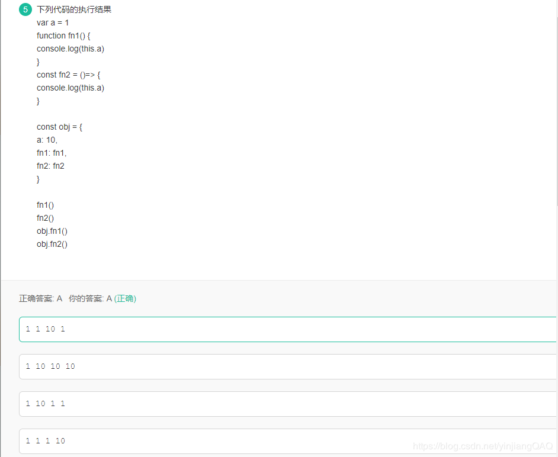

## 前言
想码这篇博文的动力是源于刷了网易2020年正式批的前端笔试题，里面有一道涉及到关于JavaScript this的问题。

 

由于这道题是我瞎蒙的，所以真正的解题思路是什么样的，我想真真正正了解一下。顺便全面地了解JavaScript的this
## 不同环境中的this含义不一样
### 全局中的this
#### 浏览器环境下
在浏览器里，在全局范围内，`this`等价于`window`对象。用`var`声明一个变量和给`this`或者window添加属性是等价的
```
<script>
   console.log(this === window) //true
   
   var a = 3;
   console.log(this.a, window.a)//3  3
</script>
```
`说明：在浏览器中window对象同时也是全局对象`
#### node环境中
在`node`环境里，在全局范围内，如果你用`REPL`(通过执行一个js文件来运行你的代码)执行一个脚本文件，用`var`声明一个变量并不会和在浏览器里面一样将这个变量添加给`this`。
```
index.js 文件在node环境中执行

var foo = "bar";
console.log(this.foo);//undefined
```
但是如果你不是用`REPL`执行脚本文件，而是直接执行代码，结果和在浏览器里面是一样的(神坑)
```
 > var foo = "bar";
 > this.foo
 bar
 > global.foo
 bar
```
在`node`环境里，用REPL运行脚本文件的时候，如果在声明变量的时候没有使用`var`或者`let`，这个变量会自动添加到`global`对象，但是不会自动添加给`this`对象。如果是直接执行代码，则会同时添加给`global`和`this`
```
index.js 文件在node环境中执行

 foo = "bar";
 console.log(this.foo);//undefined
 console.log(global.foo);//bar
```
### 函数(function)中的this
如果不是用new调用，在函数里面使用this都是指代全局范围的this。无论是浏览器环境还是node环境
```
<script>
testa()
function testa(){
     testb()
    function testb(){
        console.log(this === window)//true
      }
 }
 //在node环境下
</script>
index.js 文件在node环境中执行

foo = "bar";

function testThis () {
  this.foo = "foo";
}

console.log(global.foo);//bar
testThis();
console.log(global.foo);//foo
```
如果你在调用函数的时候在前面使用了new，this就会变成一个新的值，和global的this脱离干系。
```
<script type="text/javascript">
      foo = "bar";
  
      function testThis() {
        this.foo = "foo";
      }
  
      console.log(this.foo); //logs "bar"
      new testThis();
     console.log(this.foo); //logs "bar"
 
     console.log(new testThis().foo); //logs "foo"
</script>
```
如果想把`this`的值从一个环境传到另一个环境，就要用到`call`或者`apply`的方法。也就是说`call`和`apply`都能改变函数调用者即(`this`)的走向
```
<script type="text/javascript">
// 将一个对象作为call和apply的第一个参数，this会被绑定到这个对象。
var obj = {a: 'Custom'};

// 这个属性是在global对象定义的。
var a = 'Global';

function whatsThis(arg) {
  return this.a;  // this的值取决于函数的调用方式
}

whatsThis();          // 'Global'
whatsThis.call(obj);  // 'Custom'
whatsThis.apply(obj); // 'Custom'
</script>
```
#### 然鹅js的call和apply有什么不同呢？
首先看一下这两个函数的原型
```
obj.call(newObj, arg1, arg2, ...);
obj.apply(newObj, [arg1, arg2, ...]);
```
上面的都是把`obj`的`this`指向了`newObj`，这时`newObj`就继承了obj的属性和方法。**两者区别是接收的参数不同**，第一个参数都是函数运行的作用域`（this）` ,也就是让`this`指向这个参数 ,但是如果传递给 `this` 的值不是一个对象，JavaScript 会尝试使用内部 `ToObject `操作将其转换为对象。因此，如果传递的值是一个原始值比如 `7 `或 `‘foo’`，那么就会使用相关构造函数将它转换为对象，所以原始值 `7 `会被转换为对象，像 new Number(7) 这样，而字符串 `‘foo’ `转化成 new String(‘foo’)      
`apply`第二个参数接受的是数组参数，如果没有提供`argArray`和`newObj`任何一个参数，那么`Global对象`将用作`newObj`。  
`call`接受的是连续参数，如果没有提供`newObj`参数，那么`Global对象`被用于`newObj`。
```
    function add(c,d){
        return this.a + this.b + c + d;
    }

    var s = {a:1, b:2};
    console.log(add.call(s,3,4)); // 1+2+3+4 = 10
    console.log(add.apply(s,[5,6])); // 1+2+5+6 = 14 
```
#### 除了call和apply之外的bind
ECMAScript 5 引入了 `Function.prototype.bind`。调用`f.bind(someObject)`会创建一个与f具有相同函数体和作用域的函数，但是在这个新函数中，`this`将永久地被绑定到了bind的第一个参数，无论这个函数是如何被调用的。也就是说bind只生效一次，生效之后，永远将`this`绑定在第一个参数对象
```
<script type="text/javascript">
function f(){
  return this.a;
}

var g = f.bind({a:"azerty"});
console.log(g()); // azerty

var h = g.bind({a:'yoo'}); // bind只生效一次！
console.log(h()); // azerty

var o = {a:37, f:f, g:g, h:h};
console.log(o.f(), o.g(), o.h()); // 37, azerty, azerty
</script>
```
### prototype中的this
**你创建的每一个函数都是函数对象**，他们会自动获取**一个特殊的属性`prototype`，**你可以给这个属性赋值。当你用`new`的方式调用一个函数的时候，你就能通过`this`访问你给`prototype`赋的值了。而`prototype`属性的值可以是一个值也可以是一个函数。  
当你使用`new`为你的函数创建多个实例的时候，这些实例会共享你给`prototype`设定的值。对于下面的例子，当你调用`this.foo`的时候，都会返回相同的值，除非你在某个实例里面重写了自己的`this.foo`
```
<script type="text/javascript">
 function Thing() {
  }
  Thing.prototype.foo = "bar";
  Thing.prototype.logFoo = function () {
      console.log(this.foo);
  }
  Thing.prototype.setFoo = function (newFoo) {
      this.foo = newFoo;
  }
 
 var thing1 = new Thing();
 var thing2 = new Thing();
 
 thing1.logFoo(); //logs "bar"
 thing2.logFoo(); //logs "bar"
 
 thing1.setFoo("foo");
 thing1.logFoo(); //logs "foo";
 thing2.logFoo(); //logs "bar";
 
 thing2.foo = "foobar";
 thing1.logFoo(); //logs "foo";
 thing2.logFoo(); //logs "foobar";
</script>

```
但是记住当你给函数实例对象的属性`foo`赋值时候，实惠改变`this`的指向，但是函数对象`prototype.foo`还是原来那个
```
<script type="text/javascript">
function Thing() {
  }
  Thing.prototype.foo = "bar";
  Thing.prototype.logFoo = function () {
      console.log(this.foo, Thing.prototype.foo);
  }
  
  var thing = new Thing();
  thing.foo = "foo";
  thing.logFoo(); //logs "foo bar";
  delete thing.foo; //函数对象的属性可以删除
 thing.logFoo(); //logs "bar bar";
</script>
```
#### 而如果将bind, call, apply和prototype联系起来会怎么样
```
<script type="text/javascript">
  function Thing() {
  }
  Thing.prototype.foo = "bar";
   
  function logFoo(aStr) {
      console.log(aStr, this.foo);
  }
  //这里 logFoo是一个新的函数对象，并不是Thing的prototype里面的属性 
 var thing = new Thing();
 logFoo.bind(thing)("using bind"); //logs "using bind bar"
 logFoo.apply(thing, ["using apply"]); //logs "using apply bar"
 logFoo.call(thing, "using call"); //logs "using call bar"
 logFoo("using nothing"); //logs "using nothing undefined"  undefined是因为此时logFoo里面的this指向的是window，而全局的foo并没有定义
</script>
```
这种prototype的方式，被称为原型链，有点像JavaScript中面向对象中的继承方式。函数对象的prototype属性就像是函数对象继承来的一样。而prototype属性也刚好有值，有函数。  
但是有种情况需要特别注意一下，虽然说是很想继承关系，但是任何给用于构建原型链的函数的`this`的赋值的语句都会隐藏原型链上游的相同的属性。也就是说，如果子类已经声明相同属性foo的值了，要以子类的值为主，隐藏父类的值
```
<script type="text/javascript">
  function Thing1() {
  }
  Thing1.prototype.foo = "bar";
  
  function Thing2() {
      this.foo = "foo";//像这种已经声明了的，以这个为老大
  }
  Thing2.prototype = new Thing1();
  
 function Thing3() {
 }
 Thing3.prototype = new Thing2();
 
 var thing = new Thing3();
 console.log(thing.foo); //logs "foo"
</script>
```
### 对象(object)中的this
在一个对象的一个函数里，你可以通过`this`来引用这个对象的其他属性。这个用`new`来新建一个实例是不一样的。
```
<script type="text/javascript">
 var obj = {
     foo: "bar",
     logFoo: function () {
         console.log(this.foo);
     }
 }; 
 obj.logFoo(); //logs "bar"
</script>
```
没有使用new，没有使用`Object.create`，也没有使用函数调用创建一个对象。你也可以将对象当作一个实例将函数绑定到上面。
```
<script type="text/javascript">
 var obj = {
     foo: "bar"
 };
 
 function logFoo() {
     console.log(this.foo);
 }
 
 logFoo.apply(obj); //logs "bar"
</script>
```
当你用这种方式使用`this`的时候，并不会越出当前的对象。只有有相同直接父元素的属性才能通过`this`共享变量
```
<script type="text/javascript">
  var obj = {
      foo: "bar",
      deeper: {
          logFoo: function () {
              console.log(this.foo);
          }
      }
  };
  
 obj.deeper.logFoo(); //logs undefined
</script>
```
但是你可以直接通过对象引用你需要的属性
```
<script type="text/javascript">
	var obj = {
	    foo: "bar",
	    deeper: {
	        logFoo: function () {
	            console.log(obj.foo);
	        }
	    }
	};
	
	obj.deeper.logFoo(); //logs "bar"
</script>
```
### 最后是箭头函数下的this
箭头函数不会创建自己的this，它**只会从自己的作用域链的上一层继承this。**上一层找不到再去window找
```
function foo(){
	return (a)=>{
		console.log(this.a);
	}
}
var obj1={
	a:2
};
var obj2={
	a:3
};
var bar=foo.call(obj1);
bar.call(obj2);  //2,不是3！
```
`foo()`内部创建的箭头函数会捕获调用时`foo()`的`this`。由于`foo()`的`this`绑定到`obj1`，所以`bar`（引用箭头函数）的`this`也会绑定到`obj1`，箭头函数的绑定无法被修改。