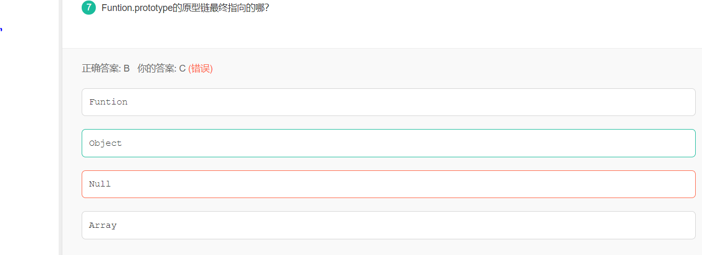

## 前言
上一篇博客我们讲到关于JavaScript中`this`的解析，里面涉及到关于JavaScript中`prototype`的内容，讲的内容比较限定于`this`，对此专门做一篇完整一点的，只关于`prototype`的博文  
而与其相关的还有刷到一道前端笔试题跟其有关的


## 关于prototype
所有的 JavaScript 对象都会从一个` prototype`（原型对象）中继承属性和方法：
* Date 对象从 Date.prototype 继承。
* Array 对象从 Array.prototype 继承。
* Person 对象从 Person.prototype 继承。  
**所有 JavaScript 中的对象都是位于原型链顶端的 `Object` 的实例。**换句话说，prototype原型链最终指向的是`object.prototype`,而  `object.prototype`对象的原型其实是一个没有任何属性和方法的`null对象`  
JavaScript 对象有一个指向一个原型对象的链。当试图访问一个对象的属性时，它不仅仅在该对象上搜寻，还会搜寻该对象的原型，以及该对象的原型的原型，依次层层向上搜索，直到找到一个名字匹配的属性或到达原型链的末尾。(有点像继承，跟上一篇博文我说的，有点类似JavaScript面向对象的继承)，因此`Date` 对象, `Array` 对象, 以及 `Person` 对象从 `Object.prototype` 继承。  
而这道题目中`function.prototype`的最终指向，而JavaScript中函数其实也是个对象，所以函数对象的`prototype`最终指向的还是`Object`
## prototype属性的作用
### 构造函数的介绍
要讲prototype属性的作用之前还是得先讲一下构造函数。  
所谓构造函数，就是提供了一个生成对象的模板并描述对象的基本结构的函数。一个构造函数，可以生成多个对象，每个对象都有相同的结构。总的来说，构造函数就是对象的模板，对象就是构造函数的实例。  
构造函数的特点有：
* 构造函数的函数名首字母必须大写。
* 内部使用this对象，来指向将要生成的对象实例。
* 使用new操作符来调用构造函数，并返回对象实例。
看一个简单的例子：
```
function Person(){
 this.name = 'keith';
}
 var boy = new Person();
 //new之后，此时的this指向boy
console.log(boy.name); //'keith'
```
### 构造函数的缺点
所有的实例对象都可以继承构造函数中的属性和方法。但是，同一个对象实例之间，无法共享属性。
```
function Person(name,height){
 this.name=name;
 this.height=height;
 this.hobby=function(){
 return 'watching movies';
}
 }
var boy=new Person('keith',180);
 var girl=new Person('rascal',153);
 console.log(boy.name); //'keith'
 console.log(girl.name); //'rascal'
 console.log(boy.hobby===girl.hobby); //false 按照我们的理解，男孩和女孩的兴趣应该是一样的，但是结果为false
 ```
上面代码中，一个构造函数Person生成了两个对象实例`boy`和`girl`，并且有两个属性和一个方法。但是，它们的`hobby`方法是不一样的。也就是说，每当你使用`new`来调用构造函数放回一个对象实例的时候，都会new一个`hobby`方法(两个方法是不一样的)，这既没有必要，又浪费资源，因为所有hobby方法都是同样的行为，完全可以被**两个对象实例共享。**这时候就需要`prototype`来提供帮助。
### prototype属性的作用
为了解决构造函数的对象实例之间无法共享属性的缺点，js提供了prototype属性。上面的例子改一下
```
function Person(name,height){
this.name=name;
this.height=height;
}
Person.prototype.hobby=function(){
return 'watching movies';
}
var boy=new Person('keith',180);
var girl=new Person('rascal',153);
console.log(boy.name); //'keith'
console.log(girl.name); //'rascal'
console.log(boy.hobby===girl.hobby); //true
```
这里把`hobby`方法放在`Person`的原型对象的属性里面了，这样你无论`new`多少个`person`实例，他们的`hobby`方法都是继承Person原型的那个`hobby`方法，都是一样的。  
但是要记住**原型对象的属性不是对象实例的属性。**对象实例的属性是继承自构造函数定义的属性，因为构造函数内部有一个`this`关键字来指向将要生成的对象实例。  
因此当修改了原型对象的hobby方法之后，两个对象实例都发生了变化。这是因为对象实例其实是没有hobby方法，都是读取person原型对象的hobby方法。
```
boy.hobby=function(){
 return 'play basketball';
 }
 console.log(boy.hobby()); //'play basketball'
 console.log(girl.hobby()); //'watching movies'
 ```
 上面代码中，**`boy`对象实例的hobby方法修改时，就不会在继承原型对象上的hobby方法了**。不过girl仍然会继承原型对象的方法。也就是说当你重写跟原型对象一样(或者便于理解，说成父类)的相同属性或者方法时，就一定按子类重写的那个属性或方法为主，如果没有重写，就继承父类的。
 ## 原型链(prototype chains)
 对象的属性和方法，有可能是定义在自身，也有可能是定义在它的原型对象。由于原型对象本身对于对象实例来说也是对象，它也有自己的原型，所以形成了一条原型链（prototype chain）。比如，a对象是b对象的原型，b对象是c对象的原型，以此类推。所有一切的对象的原型顶端，都是`Object.prototype`，即Object构造函数的`prototype`属性指向的那个对象。  
 当然，`Object.prototype对象`也有自己的原型对象，那就是没有任何属性和方法的`null对象`，而`null对象`没有自己的原型。  
原型链的特点有：
* 读取对象的某个属性时，JavaScript引擎先寻找对象本身的属性，如果找不到，就到它的原型去找，如果还是找不到，就到原型的原型去找。如果直到最顶层的`Object.prototype`还是找不到，则返回`undefined`。
* 如果对象自身和它的原型，都定义了一个同名属性，那么优先读取对象自身的属性，这叫做“覆盖”`（overiding）`。
* 一级级向上在原型链寻找某个属性，对性能是有影响的。所寻找的属性在越上层的原型对象，对性能的影响越大。如果寻找某个不存在的属性，将会遍历整个原型链

## 顺便补充讲一下_proto_
`_proto_`属性，**用来读取或设置当前对象的`prototype对象`。**目前，所有浏览器（包括 IE11）都部署了这个属性。
```
// es5 的写法
const obj = {
  method: function() { ... }
};
obj.__proto__ = someOtherObj;

// es6 的写法
var obj = Object.create(someOtherObj);
obj.method = function() { ... };
```
然鹅ES6并没有把它写进去，而是使用下面的`Object.setPrototypeOf()`（写操作）、`Object.getPrototypeOf()`（读操作）、`Object.create()`（生成操作）代替这个`_proto_`属性。

#### Object.setPrototypeOf()
也就是`Object.setPrototypeOf`方法的作用与`__proto__`相同，用来设置一个对象的`prototype对象`，返回参数对象本身。它是 ES6 正式推荐的设置原型对象的方法。
```
// 格式
Object.setPrototypeOf(object, prototype)

// 用法
const o = Object.setPrototypeOf({}, null);

//等价于用_proto_属性
function (obj, proto) {
  obj.__proto__ = proto;
  return obj;
}
```
再看一个例子更好的理解`Object.setPrototypeOf`的用法
```
let proto = {};
let obj = { x: 10 };
Object.setPrototypeOf(obj, proto);
//设置obj的原型时proto
proto.y = 20;
proto.z = 40;
//给proto新增属性，同时obj也会继承
obj.x // 10
obj.y // 20
obj.z // 40
```
如果第一个参数不是对象，会自动转为对象。但是**由于返回的还是第一个参数，**所以这个操作不会产生任何效果。
```
Object.setPrototypeOf(1, {}) === 1 // true
Object.setPrototypeOf('foo', {}) === 'foo' // true
Object.setPrototypeOf(true, {}) === true // true
```
由于`undefined`和`null`无法转为对象，所以如果第一个参数是`undefined`或`null`，就会报错。
```
Object.setPrototypeOf(undefined, {})
// TypeError: Object.setPrototypeOf called on null or undefined

Object.setPrototypeOf(null, {})
// TypeError: Object.setPrototypeOf called on null or undefined
```
#### Object.getPrototypeOf()
该方法与`Object.setPrototypeOf`方法配套，用于读取一个对象的原型对象
```
function Rectangle() {
  // ...
}

const rec = new Rectangle();

Object.getPrototypeOf(rec) === Rectangle.prototype
// true

Object.setPrototypeOf(rec, Object.prototype);
Object.getPrototypeOf(rec) === Rectangle.prototype
// false
```
如果参数不是对象，会被自动转为对象。
```
// 等同于 Object.getPrototypeOf(Number(1))
Object.getPrototypeOf(1)
// Number {[[PrimitiveValue]]: 0}

// 等同于 Object.getPrototypeOf(String('foo'))
Object.getPrototypeOf('foo')
// String {length: 0, [[PrimitiveValue]]: ""}

// 等同于 Object.getPrototypeOf(Boolean(true))
Object.getPrototypeOf(true)
// Boolean {[[PrimitiveValue]]: false}

Object.getPrototypeOf(1) === Number.prototype // true
Object.getPrototypeOf('foo') === String.prototype // true
Object.getPrototypeOf(true) === Boolean.prototype // true
```
如果参数是`undefined`或`null`，它们无法转为对象，所以会报错。
```
Object.getPrototypeOf(null)
// TypeError: Cannot convert undefined or null to object

Object.getPrototypeOf(undefined)
// TypeError: Cannot convert undefined or null to object
```


## 参考
参考阅读：https://www.cnblogs.com/douyage/p/8630529.html