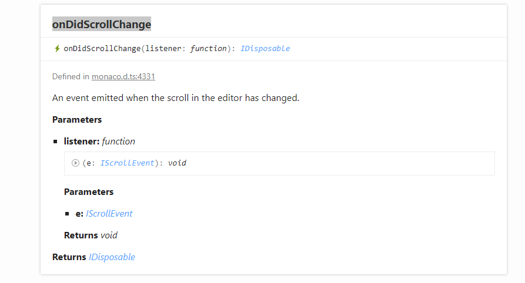
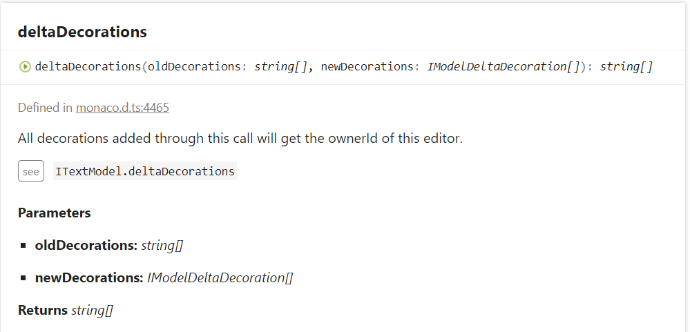

## 前言
最近想归纳一些关于Monaco 编辑器的一些内容。

## 如何本地化
* 安装`monaco-editor-locales-plugin`
```
npm install -D monaco-editor-locales-plugin  
```

配置插件，webpack配置或者vue.config.js配置
```
 //引入插件
const MonacoLocalesPlugin = require('monaco-editor-locales-plugin');  


new MonacoLocalesPlugin({  
        //设置支持的语言
        languages: ["es","zh-cn"],
        //默认语言
        defaultLanguage: "zh-cn",
        //打印不匹配的文本
        logUnmatched: false,
        //自定义文本翻译
        mapLanguages: {"zh-cn": {"Peek References": "查找引用", "Go to Symbol...": "跳到变量位置", "Command Palette": "命令面板"}}
    })
```
然后重新`npm run serve`便可以看到自己的`monaco editor`本地化了.
## 如何控制左右两个editor同步拖动
原理：通过监听`monaco editor`上的`onDidScrollChange`事件，来监听其中一个`editor`的`scrollTop`,然后在回调函数中通过`editor.setScrollTop`(监听到的editor的scrollTop)。另外那个editor同样。

```
this.leftEditor.onDidScrollChange((e)=>{
    this.rightEditor.setScrollTop(e.scrollTop)
})

this.rightEidtor.......
```

## 如何渲染代码块高亮
主要是构造`decoration`对象，这个对象有两个元素，一个是`range`,高亮代码块的范围，一个是`option`对象，这是一些配置项，更详细的可见官方文档，主要是渲染的类名.类名内容(css)主要是文字的颜色，背景色等等。

然后调用` editor.deltaDecorations(old_decorations[id], decorations)`方法。

方法接受的参数为两个，一个是旧的decoration，是一个字符串数组，另一个也是数组，但是数组里面的元素是我们刚才包装的`decoration`对象。方法返回值是一个字符串数组，然后我们需要给旧的decoration附上这个返回值       

```
  let decorations = result.map((range) => {
              let start = editor.getModel().getPositionAt(range.from);
              let end = editor.getModel().getPositionAt(range.to);
              let decoration = {
                range: new monaco.Range(
                  start.lineNumber,
                  start.column,
                  end.lineNumber,
                  end.column
                ),
                options: {
                  className: "tokenHightlignt",
                },
              };

              return decoration;
            });

            console.log(decorations);
            let ids = editor.deltaDecorations(old_decorations[id], decorations);
            old_decorations[id] = ids;


//CSS
.tokenHightlignt {
  background-color: IndianRed;
}
```

## editor的新建和销毁
普通editor的新建
```
 monaco.editor.create(document.getElementById("left"), {
        language: 'json',
        value: json_src//初始值的源代码
      });
```
普通editor的销毁
```
editor.dispose()//editor实例执行dispose方法，进行销毁

//执行完之后editor.getModel()值为Null
```
diffEditor的新建
```
 let originalModel = monaco.editor.createModel(
        this.leftEditor.getModel().getValue()
      );
      let modifiedModel = monaco.editor.createModel(
        this.rightEditor.getModel().getValue()
      );
      this.git = true;
      //新建,接受一个html节点和option配置项作为参数
      let diffEditor = monaco.editor.createDiffEditor(
        document.getElementById("mid"),
        { readOnly: true, automaticLayout: true }
      );
      //setmodel，给diffEditor设置左右两个model值，主要是为了对比
      diffEditor.setModel({
        original: originalModel,
        modified: modifiedModel
      });
```
diffEditor的销毁
```
//同样是执行this.diffEditor.dispose()
//但是执行的返回结果是{original:null,modified:null}
```

## 代码提示功能

## java代码格式化

