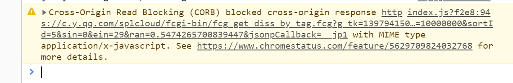

## 前言
当我做一个小demo，利用`jsonp`调用QQ音乐的接口的时候，发现http请求语法，路径等都没错，但是控制台报了如下错误：

原来是跨域的问题。我们知道浏览器出于安全考虑，是支持同源策略的。**当协议，域名，端口不同时，就 称为跨域**。跨域的时候,ajax请求就会失败。但是jsonp不就是为了解决跨域的嘛，但是我们要知道，`jsonp`也是需要服务端允许的情况下，才可以使用`jsonp`来跨域的，上面这种报错的问题是，服务端不支持`jsonp`来获取此接口

而跨域资源共享(`Cross-Origin-Resource-Sharing`)机制，是浏览器为了更安全的处理跨域请求，使其不受同源策略的限制。简单地来说就是在写入`response`头里的`Access-Control-Allow-Origin`。对应的源就可以实现跨域资源共享。由此我们知道，这种方法需要**服务端和客户端**同时实现的。

## 解决办法
我们前面知道QQ音乐有些接口因为跨域的限制，不能直接获取到数据。这是因为这个接口指定了特定的源，也就是特定的`host`和`referer`，所以我们可以用Node端做一层代理，通过`Node server`来发送请求，把请求的`host`和`referer`改为QQ音乐接口允许的`host`和`referer`,来“欺骗”QQ音乐,Node端拿到数据之后，再返回给前端，显示在页面上.

### 怎么配置Node代理

首先用 vue-cli脚手架新建一个vue项目。我用的是vue3.0的版本，可能跟2.0的版本有些不同。

在3.0的版本中，是没有`webpack.config.js`这个文件的，我们需要新建一个`vue.config.js`文件，来做一些vue项目的配置。

在配置之前我们需要安装一些package，首先要引入`express`这个包**(注意，vue3.0不会自带`express`，要自己npm )**

除了express还要再装一个`axios`，这个是基于`promise`用于浏览器和node.js客户端的一个发送http请求的package
```
npm i express --save-dev
npm i axios --save-dev
```
然后配置`vue.config.js`
```
const express = require('express');
const axios = require('axios');
var app = express();
module.exports = {
    devServer: {

        //自动打开浏览器
        open: true,
        port: 8888,
        before(app) {
            app.get('/api/getDiscList', function(req, res) {
                const url = 'https://c.y.qq.com/splcloud/fcgi-bin/fcg_get_diss_by_tag.fcg'; //node端要发送HTTP请求的url
                axios.get(url, {
                    headers: {
                        referer: 'https://c.y.qq.com', //node端伪造referer和host
                        host: 'c.y.qq.com'
                    },
                    params: req.query //请求的参数
                }).then((response) => {
                    res.json(response.data) //node端http请求成功后拿到的数据吐给前端调用/api/getDiscList接口后返回的res
                }).catch((e) => {
                    console.log(e)
                })

            })
        }
    }
}
```
`devserver`是vue项目中配置的本地服务器，`express`是node的web开发框架，`app`是`express()`返回的对象。
这里面方法`app.get(url,callback)`是一旦前端调用了这个url，node端就会执行callback，我们在`callback`中写入node端向我们真正要请求的接口的逻辑

### 前端向node端发送请求
我们在`src`目录下，新建一个`api`文件夹，然后在这个文件夹中新建一个`recommend.js`和一个`config.js`文件  

`recommend.js`文件里书写前端向node端发送请求的逻辑
```
import axios from 'axios';
import { commonParams, options } from './config';

export function getRecommend() {
    const url = 'https: //c.y.qq.com/splcloud/fcgi-bin/fcg_get_diss_by_tag.fcg';
    const data = Object.assign({}, commonParams, {
        platform: 'h5',
        uin: 0,
        needNewCode: 1
    })


}
export function getDiscList() {
    const url = '/api/getDiscList';
    const data = Object.assign({}, commonParams, {
        platform: 'yqq',
        hostUin: 0,
        sin: 0,
        ein: 29,
        sortId: 5,
        needNewCode: 0,
        categoryId: 10000000,
        rnd: Math.random(),
        format: 'json'
    })
    return axios.get(url, {
        params: data
    }).then((res) => {
        //这里的res,是之前前端调用/api/getDiscList接口返回的res
        return Promise.resolve(res.data)
    })
}
```
`config.js`文件里主要写一些配置相关的东西
```
export const commonParams = {
    g_tk: 5381,
    inCharset: 'utf-8',
    outCharset: 'utf-8',
    notice: 0,
    format: 'jsonp'
}//暴露出一个通用的参数对象
export const options = {
    params: 'jsonpCallback'
}
export const ERR_OK = 0
```

### 组件中的配置
我们前端调用node端接口的方法已经写好了，现在我们只需要在我们想要实现这个功能的组件中引入这个方法便可。

因为我是新建的一个vue项目，我就直接在`about.vue`中引入这个方法
```
<template>
  <div class="about">
    <h1>This is an about page</h1>
  </div>
</template>
<script>
import {getDiscList} from '../api/recommend'
export default {
  name: 'About',
  created(){
this._getDiscList()
  },
  methods:{
    _getDiscList(){
      getDiscList().then((res)=>{
        console.log(res.data.list)
      })
    }
  }
}
</script>

```
### 运行项目
在终端输入`npm  run serve`,vue2.0的朋友是`npm run dev`
项目运行成功之后，我们打开谷歌的开发者工具，在控制台可以看到:

我们的demo就拿到了接口的数据了。

## 最后
最后归纳一下，有些接口，如果服务端不支持`Jsonp`的话，我们只能采用node代理服务器的方式,因为`nodeServer`可以加入header，配置`host`和`referer`,来达到"欺骗"的效果

最后，千万不要用这种方法调用接口太频繁，会被封号的。


