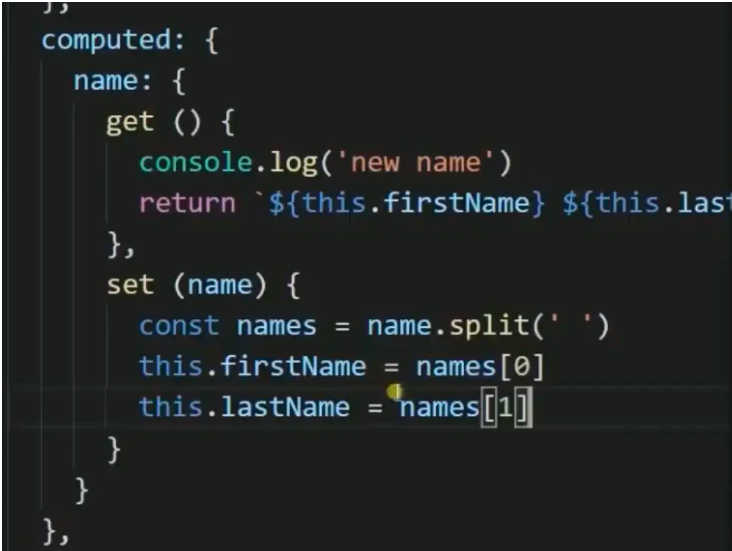
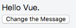
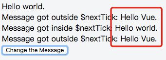

## computed

### computed属性的实现原理

* Vue实例初始化时，给data的每个属性`(dataKey)`都添加getter和setter方法  
* 计算属性`computed`初始化时，提供的函数将作为对应属性`(computedKey)`的getter方法
其中，computed属性采用**函数式声明** 
```
 computedKey: function(){
        return this.dataKey+'change'
     }
```
* 当首次获取计算属性的值是，dep开始收集依赖，即收集到dataKey和computedKey的依赖关系，也就是上面的`this.datakey+'change'`;  
在dataKey变化时，此时会调用dataKey的getter方法，通过dep收集的依赖，可以判定出data与`computed`对应数据的依赖关系  
此时可以做到，在data发生变化时，`computed`属性数据也发生变化.我们要记住的是，computed中不推荐有任何数据的改变，最好只进行计算。如果你非要进行数据的操作那么可以把监听写在`watch`（注意deep深拷贝）或者使用`computed`的`get`和`set`如下图：


### computed属性的用法
目的：是为了避免模板中加入太多的计算公式，不够精炼，而且computed属性比较节约  
官网中的写法：
```
<div id="example">
  <p>Original message: "{{ message }}"</p>
  <p>Computed reversed message: "{{ reversedMessage }}"</p>
</div>
```
```
var vm = new Vue({
  el: '#example',
  data: {
    message: 'Hello'
  },
  computed: {
    // 计算属性的 getter
    reversedMessage: function () {
      // `this` 指向 vm 实例
      return this.message.split('').reverse().join('')
    }
  }
})
```
在模板文件中，只需要在插值表达式中写**reversedMessage**这个属性即可，它与`message`有依赖关系

### computed属性与watch的区别
* 当需要数据在 **异步变化或者开销较大时** ，执行更新，使用watch会更好一些；而computed**不能进行异步操作**；  
* computed可以用 **缓存中拿数据** ，而watch是每次都要运行函数计算，不管变量的值是否发生变化，而computed在值没有发生变化时，可以直接读取上次的值  

### computed属性与methods的区别
在模板文件中，computed属性只需要写`reverseMessage`，而methods需要写成`reverseMessage()`，最明显的区别就是methods是方法，需要执行；  
computed属性只有在依赖的data放生变化时，才会重新执行，否则会使用缓存中的值，而methods是每次进入页面都要执行的，有些需要每次进入页面都执行的方法，需要使用methods，而computed属性比较节约。

## this.$nextTick

### nextTick的原理
nextTick 可以让我们在**下次 DOM 更新循环结束之后执行延迟回调**，用于获得更新后的 DOM。  
在 Vue 2.4 之前都是使用的 `microtasks`，但是 `microtasks` 的优先级过高，在某些情况下可能会出现比事件冒泡更快的情况，（也就是，出现微任务执行比点击事件之类的事件触发还要快，导致逻辑出错）但如果都使用 macrotasks 又可能会出现渲染的性能问题。所以在新版本中，会默认使用 `microtasks`，但在特殊情况下会使用 `macrotasks`，比如 v-on。

对于实现 `macrotasks` ，会先判断是否能使用 `setImmediate` ，不能的话降级为 `MessageChannel` ，以上都不行的话就使用` setTimeout`

### nextTick的使用实例
```
//模板
<div class="app">
  <div ref="msgDiv">{{msg}}</div>
  <div v-if="msg1">Message got outside $nextTick: {{msg1}}</div>
  <div v-if="msg2">Message got inside $nextTick: {{msg2}}</div>
  <div v-if="msg3">Message got outside $nextTick: {{msg3}}</div>
  <button @click="changeMsg">
    Change the Message
  </button>
</div>
```
```
//Vue实例
new Vue({
  el: '.app',
  data: {
    msg: 'Hello Vue.',
    msg1: '',
    msg2: '',
    msg3: ''
  },
  methods: {
    changeMsg() {
      this.msg = "Hello world."
      this.msg1 = this.$refs.msgDiv.innerHTML
      this.$nextTick(() => {
        this.msg2 = this.$refs.msgDiv.innerHTML
      })
      this.msg3 = this.$refs.msgDiv.innerHTML
    }
  }
})
```
点击前：  


点击后：  


此时我们看到msg1和msg3显示的内容还是变换之前的，而msg2显示的内容是变换之后的。其根本原因是因为Vue中DOM更新是异步的  
具体原因在Vue的官方文档中详细的解释：  
Vue 异步执行 DOM 更新。只要观察到数据变化，Vue 将开启一个队列，并缓冲在同一事件循环中发生的所有数据改变。如果同一个 watcher 被多次触发，只会被推入到队列中一次。这种在缓冲时去除重复数据对于避免不必要的计算和 DOM 操作上非常重要。然后，在下一个的事件循环“tick”中，Vue 刷新队列并执行实际 (已去重的) 工作。Vue 在内部尝试对异步队列使用原生的 Promise.then 和MessageChannel，如果执行环境不支持，会采用 `setTimeout(fn, 0)`代替。
 
例如，当你设置`vm.someData = 'new value'`，该组件不会立即重新渲染。当刷新队列时，组件会在事件循环队列清空时的下一个“tick”更新。多数情况我们不需要关心这个过程，但是如果你想在 DOM 状态更新后做点什么，这就可能会有些棘手。虽然 Vue.js 通常鼓励开发人员沿着“数据驱动”的方式思考，避免直接接触 DOM，但是有时我们确实要这么做。为了在数据变化之后等待 Vue 完成更新 DOM ，可以在数据变化之后立即使用Vue.nextTick(callback) 。这样回调函数在 DOM 更新完成后就会调用。

让我们回到之前的例子，执行点击事件之后msg1,msg3中对DOM进行操作，他们拿到的数据还是DOM为更新前的，还是`hello,vue`,因为上面说了，置vm.someData = 'new value'，该组件不会立即重新渲染。而msg2是写在nexttick函数里面的，它的执行会延迟到DOM更新之后，也就是msg变成`hello,world`之后，这样它操作DOM拿到的数据才是更新后的。  

这只是一个简单方便理解的例子，要是想深入了解的话，建议还是可以看一下vue.nextTick的源码。

## 参考
https://www.jianshu.com/p/a7550c0e164f  
https://segmentfault.com/a/1190000015070628

