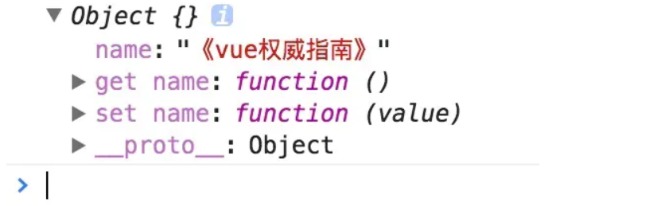
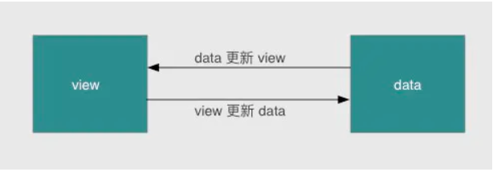
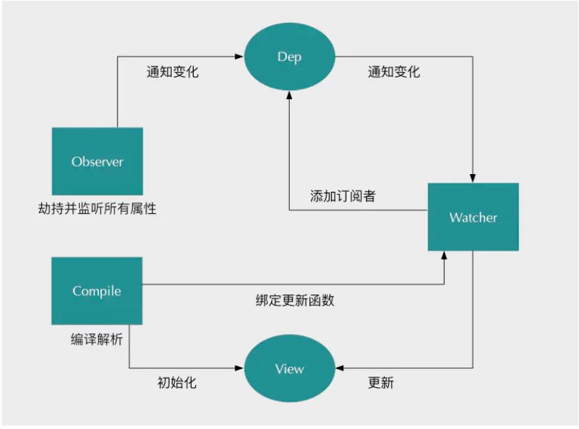

## 前言

面试问到 vue 数据的双向绑定，问深了，就有点答不上来了，所以想系统地自己搞一遍 vue 的数据双向绑定

我们概念背得够熟悉了，vue 实现数据双向绑定，借用的是**数据劫持**和**发布订阅**

## vue 实现数据双向绑定

我们都知道 vue 是通过`Object.defineProperty()`这个方法来实现数据劫持的,通过这个方法给 vm 实例中的 data 对象的每个属性设置对应的 set 和 get 方法

给一个栗子：

```js
var Book = {};
var name = "";
Object.defineProperty(Book, "name", {
  set: function (value) {
    name = value;
    console.log("你取了一个书名叫做" + value);
  },
  get: function () {
    return "《" + name + "》";
  },
});

Book.name = "vue权威指南"; // 你取了一个书名叫做vue权威指南
console.log(Book.name); // 《vue权威指南》
```

我们通过 Object.defineProperty( )设置了对象 Book 的 name 属性，对其 get 和 set 进行重写操作，顾名思义，get 就是在读取 name 属性这个值触发的函数，set 就是在设置 name 属性这个值触发的函数，所以当执行 Book.name = 'vue 权威指南' 这个语句时，控制台会打印出 "你取了一个书名叫做 vue 权威指南"，紧接着，当读取这个属性时，就会输出 "《vue 权威指南》"，因为我们在 get 函数里面对该值做了加工了。如果这个时候我们执行下下面的语句，控制台会输出什么？

```js
console.log(Book);
```


我们看到上面的数据跟我们实际上接触的 vue 实力的数据还是有点类似的，接下来我们通过原理一步步实现数据的双向绑定

## 思路分析

我们知道 mvvm 框架主要是两个方面，一个是视图的变化更新数据模型，另一个是数据的变化更新视图

关键点在于 **data 如何更新 view**，因为 view 更新 data 其实可以通过事件监听即可，比如 input 标签监听 'input' 事件就可以实现了。所以我们着重来分析下，当数据改变，如何更新视图的。

数据更新视图的重点是如何知道数据变了，只要知道数据变了，那么接下去的事都好处理。如何知道数据变了，其实上文我们已经给出答案了，就是通过 `Object.defineProperty( )`对属性设置一个 set 函数，当数据改变了就会来触发这个函数，所以我们只要将**一些需要更新的方法放在这里面就可以实现 data 更新 view 了**。
这就是大体整个实现的方向，按照之前背的概念，我们在这里都很好理解，但是实现过程是否是我们想的那么简单呢？

## 实现过程

我们已经知道实现数据的双向绑定，首先要对数据进行劫持监听，所以我们需要设置一个监听器 `Observer`，用来**监听所有属性**。如果属性发上变化了，就需要告诉订阅者 `Watcher` 看是否需要更新。因为订阅者是有很**多个**，所以我们需要有一个`消息订阅器 Dep` 来专门收集这些`订阅者`，然后在监听器 Observer 和订阅者 Watcher 之间进行统一管理的。接着，我们还需要有一个指令解析器 Compile，对每个节点元素进行扫描和解析(主要做事的过程是在编译 template 模板的时候)，将相关指令对应**初始化成一个订阅者 Watcher**，并**替换模板数据或者绑定相应的函数**，此时**当订阅者 Watcher 接收到相应属性的变化，就会执行对应的更新函数**，从而更新视图。因此接下去我们执行以下 3 个步骤，实现数据的双向绑定

- 实现一个监听器 Observer，用来劫持并监听所有属性，如果有变动的，就通知订阅者
- 实现一个订阅者 Watcher，可以收到属性的变化通知并执行相应的函数，从而更新视图
- 实现一个解析器 Compile，可以扫描和解析每个节点的相关指令，并根据**初始化模板数据**以及**初始化相应的订阅器**。

流程图如下：


## 实现 Observer

Observer 是一个数据监听器，其实现核心方法就是前文所说的`Object.defineProperty( )`。如果要对所有属性都进行监听的话，那么可以通过递归方法遍历所有属性值，并对其进行`Object.defineProperty( )`处理。如下代码，实现了一个`Observer`。

```js
function defineReactive(data, key, val) {
  observe(val);
  var dep = new Dep();
  Object.defineProperty(data, key, {
    enumerable: true,
    configurable: true,
    get: function () {
      if (Dep.target) {
        //判断是否需要添加watcher实例
        dep.addSub(dep.target);
      }
      return val;
    },
    set: function (newVal) {
      if (val === newVal) {
        return;
      }
      val = newVal;
      console.log(
        "属性" + key + "已经被监听了，现在值为：“" + newVal.toString() + "”"
      );
      dep.notify();
    },
  });
}
function observe(data) {
  if (!data || typeof data !== "object") {
    return;
  }
  //遍历所有子属性
  Object.keys(data).forEach(function (key) {
    defineReactive(data, key, data[key]);
  });
}
//依赖存储器，存储watcher实例的
function Dep() {
  this.subs = [];
}
Dep.prototype = {
  addSub: function (sub) {
    this.subs.push(sub);
  },
  notify: function () {
    this.subs.forEach(function (sub) {
      sub.update();
    });
  },
};
```

## 实现 watcher

订阅者 Watcher 在初始化的时候需要将自己添加进订阅器 Dep 中，那该如何添加呢？我们已经知道监听器 Observer 是在 get 函数执行了添加订阅者 Wather 的操作的，所以我们只要在订阅者 Watcher 初始化的时候出发对应的 get 函数去执行添加订阅者操作即可，那要如何触发 get 的函数，再简单不过了，只要获取对应的属性值就可以触发了，核心原因就是因为我们使用了`Object.defineProperty( )`进行数据监听。这里还有一个细节点需要处理，我们只要在订阅者 Watcher 初始化的时候才需要添加订阅者，所以需要做一个判断操作，因此可以在订阅器上做一下手脚：在 Dep.target 上缓存下订阅者，添加成功后再将其去掉就可以了。订阅者 Watcher 的实现如下：

```js
function Watcher(vm, exp, cb) {
  this.cb = cb;
  this.vm = vm;
  this.exp = exp;
  this.value = this.get(); //手动触发一次get，达到初始化watcher的时候，把依赖缓存进去
}
Watcher.prototype = {
  update: function () {
    this.run();
  },
  //更新视图的方法
  run: function () {
    var value = this.vm.data[this.exp];
    var oldVal = this.value;
    if (value !== oldVal) {
      this.value = value;
      this.cb.call(this.vm, value, oldVal);
    }
  },
  get: function () {
    Dep.target = this; //缓存自己
    var value = this.vm.data[this.exp]; //强制执行监听器中的get函数，把自己添加进dep
    Dep.target = null;
    return value;
  },
};
```

到此为止，简单版的 Watcher 设计完毕，这时候我们只要将 Observer 和 Watcher 关联起来，就可以实现一个简单的双向绑定数据了。因为这里没有还没有设计解析器 Compile，所以对于模板数据我们都进行写死处理，假设模板上又一个节点，且 id 号为'name'，并且双向绑定的绑定的变量也为'name'，且是通过两个大双括号包起来（这里只是为了掩饰，暂时没什么用处），模板如下：

```html
<body>
  <h1 id="name">{{name}}</h1>
</body>
```

这时候我们需要将 Observer 和 Watcher 关联起来：

```js
function SelfVue(data, el, exp) {
  this.data = data;
  observe(data);
  el.innerHTML = this.data[exp]; // 初始化模板数据的值
  new Watcher(this, exp, function (value) {
    el.innerHTML = value;
  });
  return this;
}
```

然后在页面上 new 以下 SelfVue 类，就可以实现数据的双向绑定了：

```html
<body>
  <h1 id="name">{{name}}</h1>
</body>
<script src="js/observer.js"></script>
<script src="js/watcher.js"></script>
<script src="js/index.js"></script>
<script type="text/javascript">
  var ele = document.querySelector("#name");
  var selfVue = new SelfVue(
    {
      name: "hello world",
    },
    ele,
    "name"
  );

  window.setTimeout(function () {
    console.log("name值改变了");
    selfVue.data.name = "canfoo";
  }, 2000);
</script>
```

这时候打开页面，可以看到页面刚开始显示了是`'hello world'`，过了 2s 后就变成`'canfoo'`了。到这里，总算大功告成一半了，但是还有一个细节问题，我们在赋值的时候是这样的形式 `' selfVue.data.name = 'canfoo'` ' 而我们理想的形式是`' selfVue.name = 'canfoo'` '为了实现这样的形式，我们需要在 new SelfVue 的时候做一个代理处理，让访问 selfVue 的属性代理为访问 selfVue.data 的属性，实现原理还是使用 `Object.defineProperty( )`对属性值再包一层：

```js
function SelfVue(data, el, exp) {
  var self = this;
  this.data = data;

  Object.keys(data).forEach(function (key) {
    self.proxyKeys(key); // 绑定代理属性
  });

  observe(data);
  el.innerHTML = this.data[exp]; // 初始化模板数据的值
  new Watcher(this, exp, function (value) {
    el.innerHTML = value;
  });
  return this;
}
//做一层代理
SelfVue.prototype = {
  proxyKeys: function (key) {
    var self = this;
    //这样之后，就可以直接this.name=''来触发this.data['name']=""
    Object.defineProperty(this, key, {
      enumerable: false,
      configurable: true,
      get: function proxyGetter() {
        return self.data[key];
      },
      set: function proxySetter(newVal) {
        self.data[key] = newVal;
      },
    });
  },
};
```

这下我们就可以直接通过`' selfVue.name = 'canfoo' '`的形式来进行改变模板数据了。如果想要迫切看到现象的童鞋赶快来获取代码！

## 实现 compile

虽然上面已经实现了一个双向数据绑定的例子，但是整个过程都**没有去解析 dom 节点**，而是直接固定某个节点进行替换数据的，所以接下来需要实现一个`解析器 Compile` 来做解析和绑定工作。相当于做一层自动化，自动化解析 template 模板，找出对应的需要添加订阅的 dom 节点，然后做绑定工作，解析器 Compile 实现步骤：

1. 解析模板指令，并替换模板数据，初始化视图

2. 将模板指令对应的节点绑定对应的更新函数，初始化相应的订阅器

为了解析模板，首先需要获取到 dom 元素，然后对含有 dom 元素上含有指令的节点进行处理，因此这个环节需要对 dom 操作比较频繁，所有可以先建一个`fragment`片段，将需要解析的 dom 节点存入`fragment`片段里再进行处理,为了不频繁地操作 dom 节点

```js
//把dom节点放进fragment
function nodeToFragment(el) {
  var fragment = document.createDocumentFragment();
  var child = el.firstChild;
  while (child) {
    // 将Dom元素移入fragment中
    fragment.appendChild(child);
    child = el.firstChild;
  }
  return fragment;
}
```

接下来需要遍历各个节点，对含有相关指定的节点进行特殊处理，这里咱们先处理最简单的情况，只对带有 {{变量}}  这种形式的指令进行处理，先简道难嘛，后面再考虑更多指令情况：

```js
function compileElement (el) {
    var childNodes = el.childNodes;
    var self = this;
    [].slice.call(childNodes).forEach(function(node) {
        var reg = /\{\{(.*)\}\}/;
        var text = node.textContent;

        if (self.isTextNode(node) && reg.test(text)) {  // 判断是否是符合这种形式{{}}的指令
            self.compileText(node, reg.exec(text)[1]);
        }

        if (node.childNodes && node.childNodes.length) {
            self.compileElement(node);  // 继续递归遍历子节点
        }
    });
},
function compileText (node, exp) {
    var self = this;
    var initText = this.vm[exp];
    this.updateText(node, initText);  // 将初始化的数据初始化到视图中
    new Watcher(this.vm, exp, function (value) {  // 生成订阅器并绑定更新函数
        self.updateText(node, value);
    });
},
function updateText (node, value) {
    node.textContent = typeof value == 'undefined' ? '' : value;
}
```

获取到最外层节点后，调用 compileElement 函数，对所有子节点进行判断，如果节点是文本节点且匹配 {{}} 这种形式指令的节点就开始进行编译处理，编译处理首先需要初始化视图数据，对应上面所说的步骤 1，接下去需要生成一个并绑定更新函数的订阅器，对应上面所说的步骤 2。这样就完成指令的解析、初始化、编译三个过程，一个解析器 Compile 也就可以正常的工作了。为了将解析器 Compile 与监听器 Observer 和订阅者 Watcher 关联起来，我们需要再修改一下类 SelfVue 函数：

```js
function SelfVue(options) {
  var self = this;
  this.vm = this;
  this.data = options;

  Object.keys(this.data).forEach(function (key) {
    self.proxyKeys(key);
  });

  observe(this.data);
  new Compile(options, this.vm);
  return this;
}
```

更改后，我们就不要像之前通过传入固定元素值进行双向绑定了，可以随便命名各种变量进行双向绑定了

```html
<body>
  <div id="app">
    <h2>{{title}}</h2>
    <h1>{{name}}</h1>
  </div>
</body>
<script src="js/observer.js"></script>
<script src="js/watcher.js"></script>
<script src="js/compile.js"></script>
<script src="js/index.js"></script>
<script type="text/javascript">
  var selfVue = new SelfVue({
    el: "#app",
    data: {
      title: "hello world",
      name: "",
    },
  });

  window.setTimeout(function () {
    selfVue.title = "你好";
  }, 2000);

  window.setTimeout(function () {
    selfVue.name = "canfoo";
  }, 2500);
</script>
```

到这里，一个数据双向绑定功能已经基本完成了，接下去就是需要完善更多指令的解析编译，在哪里进行更多指令的处理呢？答案很明显，只要在上文说的 `compileElement` 函数加上对其他指令节点进行判断，然后遍历其所有属性，看是否有匹配的指令的属性，如果有的话，就对其进行解析编译。这里我们再添加一个 `v-model 指令和事件指令的解析编译`，对于这些节点我们使用函数 compile 进行解析处理：

```js
function compile(node) {
  var nodeAttrs = node.attributes;
  var self = this;
  Array.prototype.forEach.call(nodeAttrs, function (attr) {
    var attrName = attr.name;
    if (self.isDirective(attrName)) {
      var exp = attr.value;
      var dir = attrName.substring(2);
      if (self.isEventDirective(dir)) {
        // 事件指令
        self.compileEvent(node, self.vm, exp, dir);
      } else {
        // v-model 指令
        self.compileModel(node, self.vm, exp, dir);
      }
      node.removeAttribute(attrName);
    }
  });
}
```

上面的 compile 函数是挂载 Compile 原型上的，它首先遍历所有节点属性，然后再判断属性是否是指令属性，如果是的话再区分是哪种指令，再进行相应的处理，处理方法相对来说比较简单，这里就不再列出来

最后我们在稍微改造下类 SelfVue，使它更像 vue 的用法：

```js
function SelfVue(options) {
  var self = this;
  this.data = options.data;
  this.methods = options.methods;

  Object.keys(this.data).forEach(function (key) {
    self.proxyKeys(key);
  });

  observe(this.data);
  new Compile(options.el, this);
  options.mounted.call(this); // 所有事情处理好后执行mounted函数
}
```

这时候我们可以来真正测试了，在页面上设置如下东西：

```html
<body>
  <div id="app">
    <h2>{{title}}</h2>
    <input v-model="name" />
    <h1>{{name}}</h1>
    <button v-on:click="clickMe">click me!</button>
  </div>
</body>
<script src="js/observer.js"></script>
<script src="js/watcher.js"></script>
<script src="js/compile.js"></script>
<script src="js/index.js"></script>
<script type="text/javascript">
  new SelfVue({
    el: "#app",
    data: {
      title: "hello world",
      name: "canfoo",
    },
    methods: {
      clickMe: function () {
        this.title = "hello world";
      },
    },
    mounted: function () {
      window.setTimeout(() => {
        this.title = "你好";
      }, 1000);
    },
  });
</script>
```

## 这种双向绑定的局限性

- 不能监听数组的变化、
- 不能监听复杂对象的变化

之前用 `Object.defineProperty`通过对象的 `getter/setter`简单的实现了对象属性变化的监听，并且去通过依赖关系去做相应的依赖处理。

看懂之前的实现之后，我们不难发现，当对象中**某个属性的值**是数组的时候。正如 Vue 文档所说：

> 由于 JavaScript 的限制，Vue 无法检测到以下数组变动：
>
> 当你使用索引直接设置一项时，例如 vm.items[indexOfItem] = newValue
>
> 当你修改数组长度时，例如 vm.items.length = newLength
>
> 因为他不是给数组这个属性赋值一个新值，所以不会触发 setter

## 解决方法

### hacking

Vue 中解决这个问题的方法，是将数组的常用方法进行重写，通过包装之后的数组方法就能够去在调用的时候被监听到。

在这里，我想的一种方法与它类似，大概就是通过原型链去拦截对数组的操作，从而实现对操作数组这个行为的监听。

实现如下：

```js
// 让 arrExtend 先继承 Array 本身的所有属性
const arrExtend = Object.create(Array.prototype);
const arrMethods = [
  "push",
  "pop",
  "shift",
  "unshift",
  "splice",
  "sort",
  "reverse",
];
/**
 * arrExtend 作为一个拦截对象, 对其中的方法进行重写
 */
arrMethods.forEach((method) => {
  const oldMethod = Array.prototype[method];
  const newMethod = function (...args) {
    oldMethod.apply(this, args);
    console.log(`${method}方法被执行了`);
  };
  arrExtend[method] = newMethod;
});

export default {
  arrExtend,
};
```

需要在 `defineReactive` 函数中添加的代码为：

```js
if (Array.isArray(value)) {
  value.__proto__ = arrExtend;
}
```

测试 `data.list.push(1)`
会发现触发了之前我们改写的逻辑，这时候，我们只需要把更新视图相关的逻辑，放在改写的方法里面，就可以实现对数组的监听了。其实就是通过改原型

但是呢，这种方法还是有局限性的，我们不能覆盖所有的数组操作，同时，我们也不能响应到类似于`data.array.length = 0`这种操作

### proxy 实现代理

proxy 是 ES6 提供的，可以自定义对象的操作，跟 Object.defineProperty 的区别是，Proxy 所带来的，是对底层操作的拦截,我们可以直接拦截对代理对象的底层操作。这样我们相当于从一个对象的底层操作开始实现对它的监听。

代码实现：

```js
const createProxy = (data) => {
  if (typeof data === "object" && data.toString() === "[object Object]") {
    for (let k in data) {
      if (typeof data[k] === "object") {
        defineObjectReactive(data, k, data[k]);
      } else {
        defineBasicReactive(data, k, data[k]);
      }
    }
  }
};

function defineObjectReactive(obj, key, value) {
  // 递归
  createProxy(value);
  obj[key] = new Proxy(value, {
    set(target, property, val, receiver) {
      if (property !== "length") {
        console.log("Set %s to %o", property, val);
      }
      return Reflect.set(target, property, val, receiver);
    },
  });
}

function defineBasicReactive(obj, key, value) {
  Object.defineProperty(obj, key, {
    enumerable: true,
    configurable: false,
    get() {
      return value;
    },
    set(newValue) {
      if (value === newValue) return;
      console.log(`发现 ${key} 属性 ${value} -> ${newValue}`);
      value = newValue;
    },
  });
}

export default {
  createProxy,
};
```

## 参考

https://juejin.im/entry/6844903479044112391

源码： https://github.com/yinjiangqaq/studyDiary/tree/master/vueReaction
