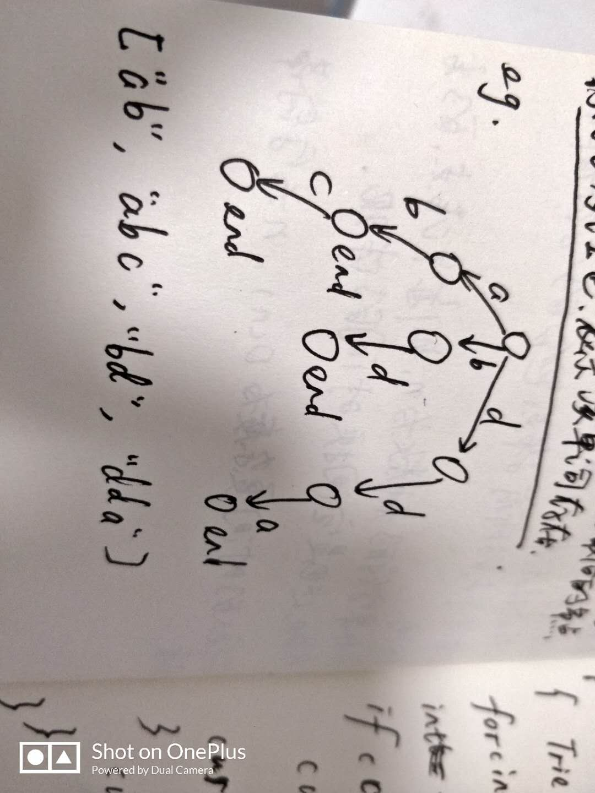

## 前言
最近想总结一些字符串算法。例如字典树，Trie树和前缀树。
## 字典树Trie
它是字符串->值得对应关系基本上它本hashmap功能相同，都是key-value对，key只能是字符串。强大之处在于时间复杂度，插入，查询的事件都是`O(k)`，k是字符串的长度，与TIrie里面存了多少元素无关。

* 根节点不包含字符，除了根节点以外的**每个节点只包含一个字符**
* 从根节点到某个节点，路径上经过的字符串连接起来，为该节点对应的字符串。
* 每个节点的所有子节点包含的字符都不相同
* 如果字符的种类为n,则每个节点的出度为n，这也是空间换时间的体现
* 插入的时间复杂度为O(n)，n为字符串的长度


插入过程：对于一个单词，从根开始，沿着单词的各个字母所对应的树中的节点分支向下走，直到单词遍历完，将最后的节点标记为红色，表示该单词已插入Trie树

查询过程：从根开始按照单词的字母顺序向下遍历，一旦发现某个节点标记不存在，或者单词遍历完成而最后的节点标记为红色，表示该单词存在。



JavaScript实现
```
class TreeNode{
    constructor(val){
        this.val=val;
        this.isEnd=false;
         this.children={}
    }
}
var Trie=function(){
    this.root=new TreeNode()
}
Trie.prototype.insert=function(str){
    let curNode=this.root;
    let arr=str.split("");
    for(let i=0;i<arr.length;i++){
        let isHashChildNode=curNode.children[arr[i]]
        if(!isHashChildNode){
            curNode.children[arr[i]]=new TreeNode(arr[i])
        }
        curNode= curNode.children[arr[i]]
        if(i===arr.length-1){
            //到最后置为true
            curNode.isEnd=true;
        }
    }
};
Trie.prototype.search=function(str){
    let curNode=this.root;
    let arr=str.split("")
    for(let i=0;i<arr.length;i++){
        if(!curNode.children[arr[i]]){
            return false
        }
        curNode=curNode.children[arr[i]]
        if(i===arr.length-1){
            return curNode.isEnd===true//判断是否有单词结束，并判断是不是这个单词
        }
    }
}

```
