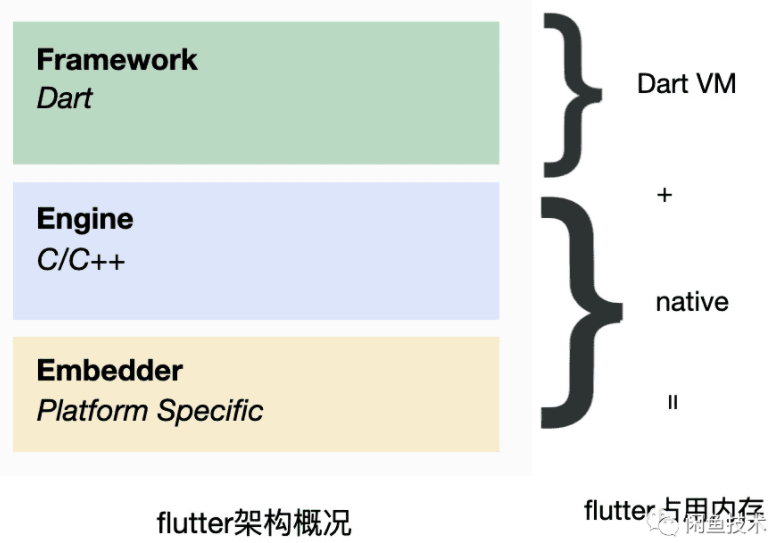
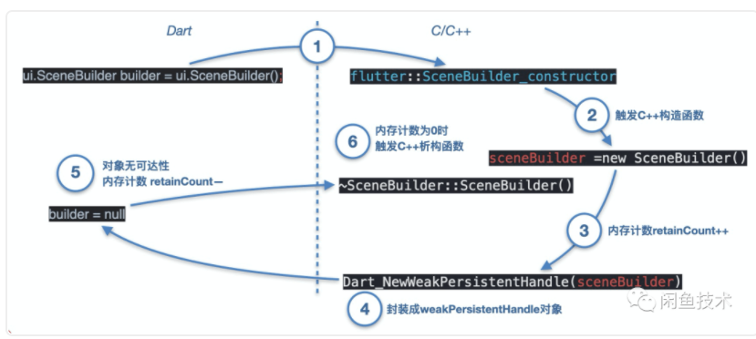
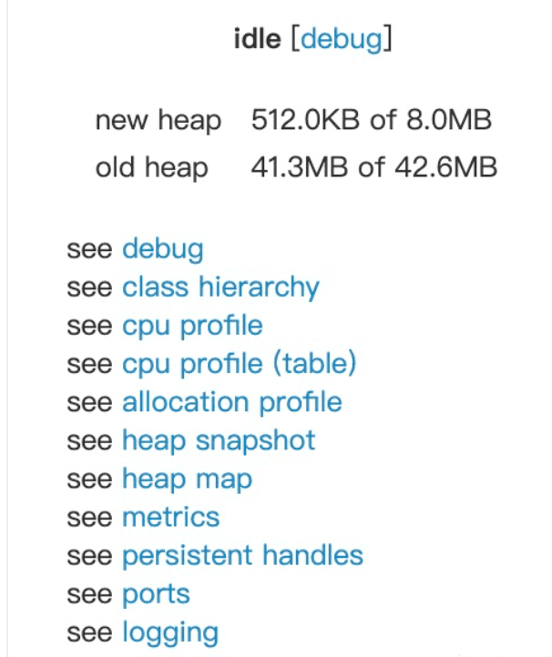
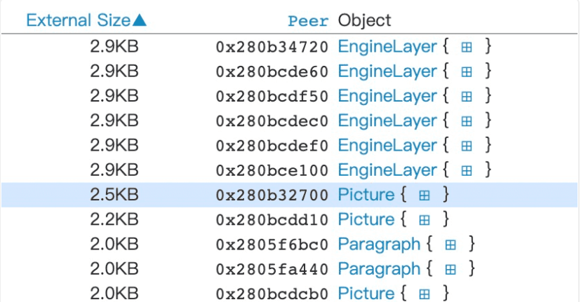
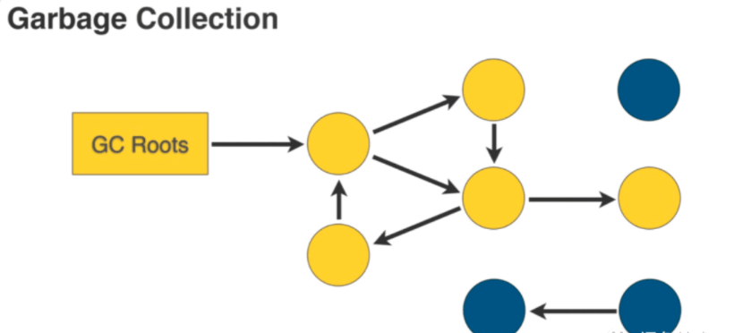
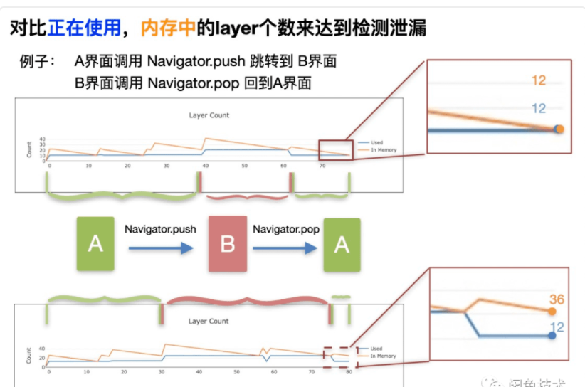
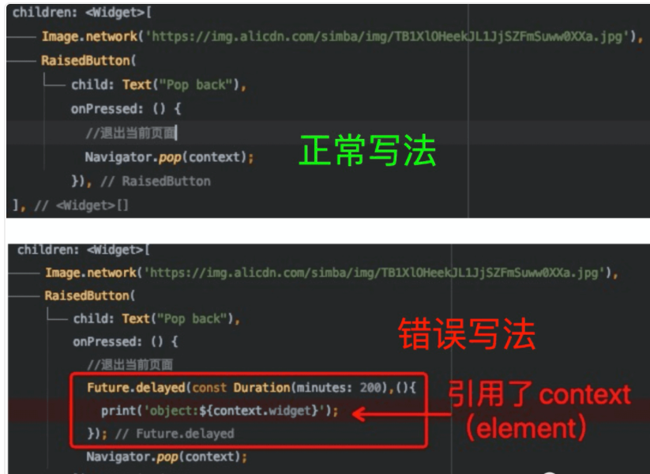

## 背景

众所周知，**内存的高低**是评判一款 app 的性能优劣的重要的指标之一。如何更简单的帮助开发者分析、暴露且解决内存泄漏问题，几乎是每一个平台或框架、开发者亟需的一个的"标配"的 feature。但是对于 flutter 社区，缺少一款用得顺手的内存泄漏工具。

对于使用 flutter 而言，因使用 dart 语言，通过形成渲染树提交到 c++的 skia 进行渲染，从 dart 层到 c++层拥有很长的渲染链路，使用者必须对整个渲染链路有通盘深刻的理解，才能深刻此时此刻的内存使用情况。本文提出一种基于渲染树个数的方式寻找内存泄漏的解决方案。

## Flutter 的内存包含哪些

### 虚拟内存还是物理内存

当我们谈论内存时，通常说的是物理内存（Physical memory），同一个应用程序运行在不同机器或者操作系统上时，会因不同操作系统和机器的硬件条件的不同，分配的到物理内存大小会有所不同，但大致而言，一款应用程序所使用到的虚拟内存（Virtual Memory）而言便会大致一样，本文讨论的都指的是虚拟内存。

我们可以直观的理解，代码中操作的所有对象都是能用虚拟内存衡量，而不太关心对象是否存在于物理内存与否，只要能减少对象的应用，尽量少的持有对象，不管白猫黑猫，能减少对象的，都是“好猫”。

### Flutter 的架构及内存组成

flutter 从使用的语言上，可以分成 3 大部分，

- Framework 层 由 Dart 编写，开发者接触到顶层，用于应用层开发

- Engine 层，由 C/C++编写，主要进行图形渲染

- Embedder 层，由植入层语言编写，如 iOS 使用 Objective-C/swift，Android 使用 java

当我们从进程角度谈论 flutter 应用的内存时，指的是这个三者所有的内存的总和。

为简化，这里可以简单的以使用者能直接接触的代码为边界，将其分成 DartVM 和 native 内存，
DartVM 指 Dart 虚拟机占用内存，而 native 内存包含 Engine 和平台相关的代码运行的内存。

我们知道 Flutter 的使用者最直接接触的是使用 Dart 语言生成的对象，那对于 Engine 层的对象的创建与销毁，是怎么实现的呢？

## Dart 绑定层如何工作

出于性能或者跨平台或其他原因，脚本语言或者基于**虚拟机的语言都会提供 c/c++或函数对象绑定到具体语言对象的接口，以便在语言中接着操控 c/c++对象或函数**，这层 API 称为**绑定层**。例如: 最易嵌入应用程序中的 Lua binding ，Javascript V8 引擎的 binding 等等。

Dart 虚拟机在初始化时，会将 C++声明的某个类或者函数和某个函数和 Dart 中的某个类或者绑定起来，依次注入 Dart 运行时的全局遍历中，当 Dart 代码执行某一个函数时，便是指向具体的 C++对象或者函数。

下面是几个常见的绑定的几个 c++类和对应的 Dart 类

> flutter::EngineLayer --> ui.EngineLayer
>
> flutter::FrameInfo --> ui.FrameInfo
>
> flutter::CanvasImage --> ui.Image
>
> flutter::SceneBuilder --> ui.SceneBuilder
>
> flutter::Scene --> ui.Scene

以 `ui.SceneBuilder`一个例子了解下 Dart 是如何绑定 c++对象实例，并且控制这个 c++实例的析构工作。

> Dart 层渲染过程是配置的 layer 渲染树，并且提交到 c++层进行渲染的过程。ui.SceneBuilder 便是这颗渲染树的容器

1. Dart 代码调用构造函数 ui.SceneBuilder()时，调用 c++方法 SceneBuilder_constructor

2. 调用 flutter::SceneBuilder 的构造方法并生成 c++实例 sceneBuilder

3. 因 flutter::SceneBuilder 继承自内存计数对象 RefCountedDartWrappable，对象生成后会内存计数加 1

4. 将生成 c++实例 sceneBuilder 使用 Dart 的 API 生成一个 WeakPersitentHandle，注入到 Dart 上下中。在这里之后，Dart 便可使用这个 builder 对象，便可操作这个 c++的 flutter::SceneBuilder 实例。

5. 程序运行许久后，当 Dart 虚拟机判断 Dart 对象 builder 没有被任何其他对象引用时（例如简单的情况是被置空 builder=null，也称为无可达性），对象就会被垃圾回收器（Garbage Collection）回收释放，内存计数将会减一

6. 当内存计数为 0 时，会触发 c++的析构函数，最终 c++实例指向的内存块被回收

可以看到，Dart 是通过将 C/C++实例封装成 WeakPersitentHandle 且注入到 Dart 上下文的方式，从而利用 Dart 虚拟机的 GC（Garbage Collection）来控制 C/C++实例的创建和释放工作

更直白而言，只要 C/C++实例对应的 Dart 对象能正常被 GC 回收，C/C++所指向的内存空间便会正常释放。

## WeakPersistentHandle 是什么

因为 Dart 对象在 VM 中会因为 GC 整理碎片化中经常移动，所以使用对象时不会直接指向对象，而是使用句柄（handle）的方式间接指向对象，再者 c/c++对象或者实例是介乎于 Dart 虚拟机之外，生命周期不受作用域约束，且一直长时间存在于整个 Dart 虚拟机中，所以称为常驻（Persistent），所以 WeakPersistentHandle 专门指向生命周期与常在的句柄，在 Dart 中专门用来封装 C/C++实例。

在 flutter 官方提供的 Observatory 工具中，可以查看所有的 WeakPersistentHandle 对象

其中 Peer 这栏也就是封装 c/c++对象的指针

## Dart 对象的可达性

Dart 对象释放会被垃圾回收器（Garbage Collection）进行释放，是通过判定对象是否还有可达性（availability）来达到的。可达性是指通过某些根节点出发，通过对象与对象间的引用链去访问对象，如可通过引用链去访问对象，则说明对象有可达性，否则无可达性。

黄色有可达性，蓝色无可达性

## 难以察觉的内存泄漏

看到这里我们会发现一个问题，其实我们很难从 Dart 侧感知 C/C++对象的消亡，因为 Dart 对象无统一的如同 C++类一样的析构函数，一旦对象因为循环引用等的原因被长期其他对象长期引用，GC 将无法将其释放，最终导致内存泄漏。

将问题放大一点，我们知道 flutter 是一个渲染引擎，我们通过编写 Dart 语言构建出一颗 Widget 树，进而经过绘制等过程简化成 Element 树，RenderObject 树，Layer 树，并将这颗 Layer 树提交至 C++层，进而使用 Skia 进行渲染。

如果某个 Wigdet 树或 Element 树的某个节点长期无法得到释放，将可能造成他的子节点也牵连着无法释放，将泄漏的内存空间迅速扩大。

例如，存在两个 A，B 界面，A 界面通过 Navigator.push 的方式添加 B 界面，B 界面通过 Navigator.pop 回退到 A。如果 B 界面因为某些写法的缘故导致 B 的渲染树虽然被从主渲染树解开后依然无法被释放，这会导致整个原来 B 的子树都无法释放。

### 检测方法

基于上面的这一个情况，我们其实可以通过对比当前帧使用到的渲染节点个数，对比当前内存中渲染节点的个数来判断前一个界面释放存在内存泄漏的情况。

Dart 代码中都是通过往 ui.SceneBuilder 添加 EngineLayer 的方式去构建渲染树，那么我们只要检测 c++中内存中 EngineLayer 的个数，对比当前帧使用的 EngineLayer 个数，如果内存中的 EngineLayer 个数长时间大于使用的个数，那么我们可以判断存在有内存泄漏

依然以上次 A 页面 pushB 界面，B 界面 pop 回退 A 界面为例子。正常无内存泄漏的情况下，正在使用的 layer 个数（蓝色），内存中的 layer 个数（橙色）两条曲线的虽然有波动，但是最终都会比较贴合。

但是在 B 页面存在内存泄漏的时候，退到 A 界面后，B 树完全无法释放，内存中的 layer 个数（橙色）无法最终贴合蓝色曲线（正在使用的 layer 个数）

也就是说，对于渲染而言，如果代码导致 Widget 树或 Element 树长时间无法被 GC 回收，很可能会导致严重的内存泄漏情况。

### 什么导致了内存泄漏

目前发现异步执行的代码的场景(Feature, async/await,methodChan）长期持有传入的 BuildContext，导致 element 被移除后，依然长期存在，最终导致以及关联的 widget， state 发生泄漏。

再继续看 B 页面泄漏的例子

正确与错误的写法的区别在于，错误的仅是在调用 Navigator.pop 之前，使用异步方法 Future 引用了 BuildContext，便会导致 B 界面内存泄漏。

## 怎么发现内存泄漏点

目前 flutter 内存泄漏检测工具的设计思路是，对比界面进入前后的对象，寻找出未被释放的对象，进而查看未释放的引用关系（Retaining path 或 Inbound references），再结合源码进行分析，最后找到错误代码。

使用 Flutter 自带的 Observatory 纵然可以一个一个查看每个泄漏对象的引用关系，但是对于一个稍微复杂一点的界面而言，最终生成的 layer 个数是非常庞杂的，想要在 Observatory 所有的泄漏对象中找到有问题的代码是一项非常庞杂的任务。

为此我们将这些繁杂的定位工作都进行了可视化。

我们这里将每一帧提交到 engine 的所有 EngineLayer 进行了一个记录，并且以折线图的形式记录下来，如果上文说的**内存中的 layer 个数异常的大于使用中的 layer 个数**，那么就可判断前一个页面存在有内存泄漏。

进而，还可以抓取当前页面的 layer 树的结构，用以辅助定位具体由哪个 RenderObject 树生成的 Layer 树，进而继续分析由哪个 Element 节点生成的 RenderObject 节点,或者也可以打印出 WeakPersitentHandle 的引用链辅助分析,但如今的痛点依然存在，依然需要通过查看 Handle 的引用链，结合源码的分析才能最终比较快捷的定位问题。这也是接下来亟需解决的问题。

## 总结

- 我们这种从渲染树的角度去探寻 flutter 内存泄漏的方法，可以推广到所以其他 Dart 不同类型的对象。

- 开发者在编写代码时，需要时刻注意异步调用，以及时刻注意操纵的 Element 会否被引用而导致无法释放

## 参考

[闲鱼技术](https://mp.weixin.qq.com/s?__biz=MzU4MDUxOTI5NA==&mid=2247485786&idx=1&sn=c46a52ce501d1681b040c552a027733f&chksm=fd54dd4bca23545defa1d4a43fd1598c3cd8910ad89f5485178a3519be190fb7c8803b78a972&mpshare=1&scene=1&srcid=09249fZT5OjDvcMVWamieKsl&sharer_sharetime=1600917920679&sharer_shareid=f0905f0408effed4fda33087fe9c2205&key=a509228a02d3b1bdb189f536fc372c7a221dadc97feec89318b6996621aba8a6c4a270b225ab1c35775ed2720b15fc21cbd55d19e0cfd0a62e59675827b4dc1c6b57846bbc0dc896d3a1b1b251b93e41c9da439f4c66d13992df25d5d821509ff36a50df2a4cf37834284459a65db13971faf52a0496b570a3794e3f2519f58a&ascene=1&uin=MzAzMDM5NTQ4OQ%3D%3D&devicetype=Windows+10+x64&version=62090529&lang=zh_CN&exportkey=A03yMHMtvRT%2BxxiumMrgQvU%3D&pass_ticket=evOyM%2F50s5c%2FWbEXPc%2BS9%2B5PYGyRPdKg0s5XxrP0RuvPVlgiYw%2BC7sXMFmclU%2FHZ&wx_header=0)
