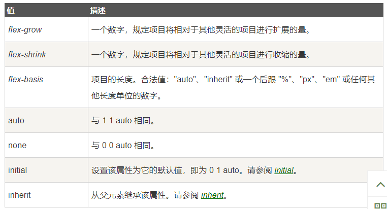

## canvas元素解析
### 什么是canvas？
HTML5 的 `canvas` 元素使用 JavaScript 在网页上绘制图像。
画布是一个矩形区域，您可以控制其每一像素。
`canvas` 拥有多种绘制路径、矩形、圆形、字符以及添加图像的方法
### 创建canvas元素
规定元素的 id、宽度和高度：
```
<canvas id="myCanvas" width="200" height="100"></canvas>
```
### 通过JavaScript来绘制
`canvas` 元素本身是没有绘图能力的。所有的绘制工作必须在 JavaScript 内部完成：
```
<script type="text/javascript">
var c=document.getElementById("myCanvas");//找到画布
var cxt=c.getContext("2d");//创建context对象，context对象是内建的HTML5对象
cxt.fillStyle="#FF0000";//绘制context对象的颜色
cxt.fillRect(0,0,150,75);//绘制形状，左上角坐标为(0,0)，再画布上绘制150*75的矩形
</script>
```
`除了矩形，还可以通过JavaScript绘制线条，圆形，加入图片等等`
把一幅图像放置到画布上：
```
<script type="text/javascript">

var c=document.getElementById("myCanvas");
var cxt=c.getContext("2d");
var img=new Image()
img.src="flower.png"
cxt.drawImage(img,0,0);

</script>
```
### canvas需要注意的点
` <canvas width="250" height="250"></canvas> `有个矩形长20px，高10px,CSS中width：250px  height：500px，请问这个矩形渲染出来的实际面积?  
画布大小和CSS中设置width：250px  height：500px一致，其width和初始值比例为1:1，height和初始值比例为2:1。**因此渲染出来的矩形的高度也将扩大一倍为20px，**则矩形渲染出来的实际面积20X20=400。

## CSS中的flex属性
### flex属性的定义
`flex` 属性用于设置或检索弹性盒模型对象的子元素如何分配空间。  
`flex` 属性是`flex-grow`、`flex-shrink` 和 `flex-basis `属性的简写属性。
属性值：

CSS语法：
```
flex: flex-grow flex-shrink flex-basis|auto|initial|inherit;
```
### flex布局的作用
以前在写导航栏的时候，总是用`float`或者`display：inline-block`实现，但是这两种方法都会有各种问题，比如浮动会影响父元素以及兄弟元素的样式，需要**清除浮动**, 现在用flex会很方便，并且是**弹性布局**
举个栗子：
```
<!-- HTML代码 -->
<ul>
 <li>音乐</li>
 <li>影视</li>
 <li>旅游</li>
</ul>

<!-- CSS代码 -->
ul{
  display: flex;         
}
li{
  flex: 1;
  text-align: center;
  line-height: 100px;
}
```
效果图如下

我们只要在HTML代码里面多加两个li元素，导航便弹性变化,不需要改动CSS代码

### 关于flex那三个属性的计算问题
前面讲到`flex` 属性是`flex-grow`、`flex-shrink` 和 `flex-basis `属性的简写属性。
拿一个栗子方便讲解：  
下列布局在页面上的宽度比是多少？ `答案 2：3`
```
// css
.flex {
display: flex;
width: 200px;
height: 100px;
}
.left {
flex: 3 0 50px;
background: red;
}
.right {
flex: 2 0 100px;
background: blue;
}
// html
<div class="flex">
    <div class="left"></div>
    <div class="right"></div>
</div>
```
首先我们知道外层`flex`被设置为flex布局，然后left层的`flex:3 0 50px`；意思就是放大3倍，然后`flex-basis`定为50px，意思就是宽度为50px。  
同理看right布局，`flex: 2 0 100px;`意思是放大两倍，`flex-basis`定为100px，宽度为100px。  
现在我们外层flex总宽度为200px，减去left的50px，再减去right的100px，剩下50px。剩下的50px按照各自的放大倍数比例去分配空间，left分到50*3/5=30px,right分到20px。所以最后left布局应该是80px，right布局应该是120px。他们的宽度比2：3

`除此之外，我们要注意的是，flex-basis为0%时，表示在分配多余的空间之前。该项目已经不占据空间了，他的 width已经失效了,这个元素的width为0 ，而最后的width还是要这个元素的width加上分配完全部剩下的按放大比例分配的width。 当flex-basis为auto时，则width取值为这个元素原先设置的width。最后的width算法同上。`

## 参考
推荐阅读：  
          https://www.cnblogs.com/yiyistar/p/6539485.html  
          https://www.cnblogs.com/maqunjing/p/3155180.html


