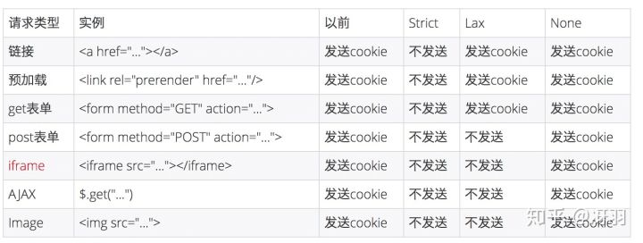

## 前言

2 月份发布的 Chrome 80 版本中默认屏蔽了第三方的 Cookie，在灰度期间，就导致了阿里系的很多应用都产生了问题，为此还专门成立了小组，推动各 BU 进行改造，目前阿里系基本已经改造完成。所有的前端团队估计都收到过通知，也着实加深了一把大家对于 Cookie 的理解，所以很可能就此出个面试题，而即便不是面试题，当问到 HTTP 相关内容的时候，不妨也扯到这件事情来，一能表明你对前端时事的跟进，二还能借此引申到前端安全方面的内容，为你的面试加分。

所以本文就给大家介绍一下浏览器的 Cookie 以及这个"火热"的 SameSite 属性

## HTTP

一般我们都会说 “HTTP 是一个无状态的协议”，不过要注意这里的 HTTP 其实是指 HTTP 1.x，而所谓无状态协议，**简单的理解就是即使同一个客户端连续两次发送请求给服务器，服务器也识别不出这是同一个客户端发送的请求**，这导致的问题就比如你加了一个商品到购物车中，但因为识别不出是同一个客户端，你刷新下页面就没有了……所以我们需要一种东西来**保持状态**

## Cookie

为了解决 HTTP 无状态导致的问题，后来出现了 Cookie。不过这样说可能会让你产生一些误解，首先无状态并不是不好，有优点，但也会导致一些问题。而 Cookie 的存在也不是为了解决通讯协议无状态的问题，只是**为了解决客户端与服务端会话状态的问题**，这个状态是指**`后端服务`的状态而非通讯协议的状态**。

Cookie（复数形态 Cookies），类型为「小型文本文件」，指某些网站为了辨别用户身份而储存在用户本地终端上的数据。

作为一段一般不超过 4KB 的小型文本数据，它由一个名称（Name）、一个值（Value）和其它几个用于控制 Cookie 有效期、安全性、使用范围的可选属性组成，这些涉及的属性我们会在后面会介绍。

## Cookie 的设置

- 客户端发送 HTTP 请求到服务器
- 当服务器收到 HTTP 请求时，在响应头里面添加一个 Set-Cookie 字段
- 浏览器收到响应后保存下 Cookie
- 之后对该服务器每一次请求中都通过 Cookie 字段将 Cookie 信息发送给服务器。

## Cookie 的属性

### Name/Value

用 JavaScript 操作 Cookie 的时候注意对 Value 进行`编码处理`。为了安全的加密

### Expires

Expires 用于设置 Cookie 的过期时间(时间戳）。比如：

```
Set-Cookie: id=a3fWa; Expires=Wed, 21 Oct 2015 07:28:00 GMT;
```

### Max-Age

Max-Age 用于设置在 Cookie 失效之前需要经过的秒数。比如：

```
Set-Cookie: id=a3fWa; Max-Age=604800;
```

Max-Age 可以为正数、负数、甚至是 0。

如果 max-Age 属性为正数时，浏览器会将其持久化，即写到对应的 Cookie 文件中。

当 max-Age 属性为**负数**，则表示该 Cookie 只是一个**会话性 Cookie**。

当 max-Age 为 0 时，则会**立即删除这个 Cookie**。

假如 Expires 和 Max-Age 都存在，Max-Age 优先级更高。

## Domain

Domain 指定了 Cookie 可以送达的主机名。假如没有指定，那么默认值为当前文档访问地址中的主机部分（但是不包含子域名）。

像淘宝首页设置的 Domain 就是 `.http://taobao.com`，这样无论是 `a.taobao.com` 还是 `b.taobao.com` 都可以使用 `Cookie`。

在这里注意的是，`不能跨域设置 Cookie`，比如阿里域名下的页面把 Domain 设置成百度是无效的：

```
Set-Cookie: qwerty=219ffwef9w0f; Domain=baidu.com; Path=/; Expires=Wed, 30 Aug 2020 00:00:00 GMT
```

### Path

Path 指定了一个 URL 路径，这个路径必须出现在要请求的资源的路径中才可以发送 Cookie 首部。比如设置 **Path=/docs，/docs/Web/ 下的资源会带 Cookie 首部，/test 则不会携带 Cookie 首部。**

Domain 和 Path 标识共同定义了 Cookie 的作用域：即 Cookie 应该发送给哪些 URL。

### Secure 属性

标记为 Secure 的 Cookie **只应通过被 HTTPS 协议加密过的请求发送给服务端**。使用 HTTPS 安全协议，可以保护 Cookie 在浏览器和 Web 服务器间的传输过程中不被窃取和篡改。

### HTTPOnly

设置 HTTPOnly 属性可以防止客户端脚本通过 document.cookie 等方式访问 Cookie，有助于避免 XSS 攻击。

### SameSite

SameSite 是最近非常值得一提的内容，因为 2 月份发布的 Chrome80 版本中默认屏蔽了第三方的 Cookie，这会导致阿里系的很多应用都产生问题，为此还专门成立了问题小组，推动各 BU 进行改造。

SameSite 属性可以让 Cookie 在跨站请求时不会被发送，从而可以阻止跨站请求伪造攻击（CSRF）
SameSite 可以有下面三种值：

- Strict 仅允许一方请求携带 Cookie，即浏览器将只发送相同站点请求的 Cookie，即当前网页 URL 与请求目标 URL 完全一致。
- Lax 允许部分第三方请求携带 Cookie
  None 无论是否跨站都会发送 Cookie
- 之前默认是 None 的，Chrome80 后默认是 `Lax`。

### 跨域和跨站

首先要理解的一点就是跨站和跨域是不同的。同站(same-site)/跨站(cross-site)」和第一方(first-party)/第三方(third-party)是等价的。但是与浏览器同源策略（SOP）中的「同源(same-origin)/跨域(cross-origin)」是完全不同的概念。

同源策略的同源是指两个 URL 的协议/主机名/端口一致。例如，https://www.taobao.com/pages/...，它的协议是 https，主机名是 www.taobao.com，端口是 443。

同源策略作为浏览器的安全基石，其「同源」判断是比较严格的，相对而言，Cookie 中的「同站」判断就比较宽松：只要两个 URL 的 eTLD+1 相同即可，不需要考虑协议和端口。其中，eTLD 表示有效顶级域名，注册于 Mozilla 维护的公共后缀列表（Public Suffix List）中，例如，.com、`.co.uk`、`.github.io` 等。eTLD+1 则表示，有效顶级域名+二级域名，例如 taobao.com 等。

举几个例子，www.taobao.com 和 www.baidu.com 是跨站，www.a.taobao.com 和 www.b.taobao.com 是同站，a.github.io 和 b.github.io 是跨站(注意是跨站)。

### 改变

接下来看下从 None 改成 Lax 到底影响了哪些地方的 Cookies 的发送？直接来一个图表

从上图可以看出，对大部分 web 应用而言，Post 表单，iframe，AJAX，Image 这四种情况从以前的跨站会发送三方 Cookie，变成了不发送。

Post 表单：应该的，学 CSRF 总会举表单的例子。

iframe：iframe 嵌入的 web 应用有很多是跨站的，都会受到影响。

AJAX：可能会影响部分前端取值的行为和结果。

Image：图片一般放 CDN，大部分情况不需要 Cookie，故影响有限。但如果引用了需要鉴权的图片，可能会受到影响。

除了这些还有 script 的方式，这种方式也不会发送 Cookie，像淘宝的大部分请求都是 `jsonp`，如果涉及到跨站也有可能会被影响。

### 问题

我们再看看会出现什么的问题？举几个例子：

- 天猫和飞猪的页面靠请求淘宝域名下的接口获取登录信息，由于 Cookie 丢失，用户无法登录，页面还会误判断成是由于用户开启了浏览器的“禁止第三方 Cookie”功能导致而给与错误的提示
- 淘宝部分页面内嵌支付宝确认付款和确认收货页面、天猫内嵌淘宝的登录页面等，由于 Cookie 失效，付款、登录等操作都会失败
- 阿里妈妈在各大网站比如今日头条，网易，微博等投放的广告，也是用 iframe 嵌入的，没有了 Cookie，就不能准确的进行推荐
- 一些埋点系统会把用户 id 信息埋到 Cookie 中，用于日志上报，这种系统一般走的都是单独的域名，与业务域名分开，所以也会受到影响。
- 一些用于防止恶意请求的系统，对判断为恶意请求的访问会弹出验证码让用户进行安全验证，通过安全验证后会在请求所在域种一个 Cookie，请求中带上这个 Cookie 之后，短时间内不再弹安全验证码。在 Chrome80 以上如果因为 Samesite 的原因请求没办法带上这个 Cookie，则会出现一直弹出验证码进行安全验证。
- 天猫商家后台请求了跨域的接口，因为没有 Cookie，接口不会返回数据

### 解决办法

解决方案就是设置`SameSite`为`none`。

注意的地方:

- HTTP 接口不支持 SameSite=none
  如果你想加 SameSite=none 属性，那么该 Cookie 就必须同时加上 Secure 属性，表示只有在 HTTPS 协议下该 Cookie 才会被发送。

- 需要 UA 检测，部分浏览器不能加 SameSite=none
  IOS 12 的 Safari 以及老版本的一些 Chrome 会把 SameSite=none 识别成 SameSite=Strict，所以服务端必须在下发 Set-Cookie 响应头时进行 User-Agent 检测，对这些浏览器不下发 SameSite=none 属性

## cookie 的作用

Cookie 主要用于以下三个方面：

- 会话状态管理（如用户登录状态、购物车、游戏分数或其它需要记录的信息）
- 个性化设置（如用户自定义设置、主题等）
- 浏览器行为跟踪（如跟踪分析用户行为等）

## cookie 的缺点

如果被问到话，可以从大小、安全、增加请求大小等方面回答。

## Cookie 的发送情况 父域名会发送子域名的 cookie?

我们要知道子域名可以获取父级域名的 cookie 的，父域名发送请求的话，只会携带父级域名的 cookie，是携带不了子域名的 cookie 的

## 如何获取 cookie

### 以前操作 cookie

用 JS 操作 Cookie 其实是很麻烦的，并不存在一个简单的 API 能让我们获取或者设置 Cookie。

唯一一个操作 Cookie 的 API 是 document.cookie，但是这句代码使用起来很难受。如果说我们想要获取一个需要的 Cookie，可能得先写这么一个 `utils` 函数：

```js
function getCookie(name) {
  const value = `; ${document.cookie}`;
  const parts = value.split(`; ${name}=`);
  if (parts.length === 2) return parts.pop().split(";").shift();
}
//设置cookie
const setCookie = (cookieKey, cookieValue, expirationDays) => {
  let expiryDate = '';
  if (expirationDays) {
    const date = new Date();
    date.setTime(`${date.getTime()}${(expirationDays || 30 * 24 * 60 * 60 * 1000)}`);
    expiryDate = `; expiryDate=" ${date.toUTCString()}`;
  }
  document.cookie = `${cookieKey}=${cookieValue || ''}${expiryDate}; path=/`;
}
```

但是在 Chrome 87 版本中我们无需再引入这样的代码了，取而代之的是新的 API：`cookieStore`。这是一个异步的 API，可以很方便地获取设置以及监听 `Cookie` 的改变。

### 通过 cookie.Store 获取 cookie

```js
cookieStore.set('lin',1)//undefined
cookieStore.get('lin')//{domain:null,expires:null,name:'lin',path:"/",sameSite:"strict",...}

cookieStore.getAll({domain:'juejin.im'})
cookieStore.delete('lin')

```

## 参考

https://zhuanlan.zhihu.com/p/114093227
