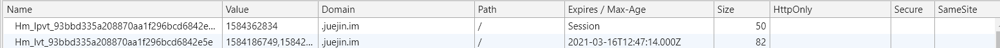

## 前言
接二连三受挫，想做一篇总结篇吧。  
## cookie和session的区别

### cookie是客户端保持状态的方案，session是服务端保持状态的方案
cookie是服务器在本地机器上存储的小段文本并随着每一个请求发送至同一个服务器。网络服务器用HTTP响应头向客户端发送cookies，在客户终端，浏览器解析这些cookies并将它们保存为一个本地文件，它会自动将同一服务器的任何请求缚上这些cookies 。很多浏览器限制一个站点最多保存20个cookie   


那为什么要携带这个cookie呢，因为cookie的作用就是为了解决HTTP协议无状态的缺陷所作的努力。cookie的内容主要包括：名字，值，过期时间，路径和域。**(可以理解成键值对，外加一些其他的属性)**一般用户的敏感信息就会存在value字段。每次请求携带cookie相当于客户端在告诉服务器，现在是谁谁谁和你通信.所以说，**cookie是客户端保持状态的方案**

图一、   cookie的一些属性
cookie又分为两种：
* 会话cookie：不设置过期时间，只要关闭浏览器，就会消失。生命周期是浏览器会话期间，一般保存在内存上

* 持久性cookie：设置过期时间，**会保存在用户硬盘上**，同一浏览器可以访问，直到到了过期时间

既然cookie是服务端生成的，那怎么生成呢？ (错，cookie真正的话，是客户端浏览器生成的，服务端只是通过`set-cookie`，告知客户端要生成怎么样的cookie)   
服务器通过在HTTP的响应头(第一次访问网站服务器的reponse头)中加上一行特殊的指示以提示浏览器按照指示生成相应的cookie
服务端那边写代码给HTTP响应头加入`set-Cookie`字段（cookie其实跟键值对差不多)
```
//HTTP响应头
HTTP/1.1 200 OK
Content-type: text/html
Set-Cookie: foo=10
Set-Cookie: bar=20; Expires=Fri, 30 Sep 2011 11:48:00 GMT
... rest  of the response
```
这里两个cookie foo = 10和bar = 20被存储在浏览器中。第二个将在9月30日到期。在随后的每个请求中，浏览器都会将cookie发送回服务器。

后面浏览器给服务器发送的请求的时候，请求头(会携带上cookie)：
```
GET /spec.html HTTP/1.1
Host: www.example.com
Cookie: foo=10; bar=20
Accept: */*
```
所以说跟`cookie`相关的，有两个`http`头部字段，`set-cookie`和`cookie`
set-cookie是http响应头，由服务端发送，它用于在客户端创建cookie  
`cookie`时`http`请求头部的字段，由客户端发送有`cookie`的`domain`和`path`与请求的URL匹配才会发送这个`cookie`。

那客户端浏览器怎么手动生成cookie嘛？
答案是可以的。我们可以在chrome的控制台上，加入如下代码：
```
document.cookie = 'age =18;max-age=1000'
```
然后你就可以看到cookie选项多了个`age=18`的cookie。然后这个cookie的长度，或者说size就是字符串'age18'的length，为5.其实还是挺符合定义，cookie是服务器存在本地机器上的**一小段文本**
那前端既然可以用JavaScript创建cookie，那怎么清除掉呢。
```
delCookies(name){

var exp = new Date();

exp.setTime(exp.getTime() - 1);

var cval = this.getCookie(name);

if(cval != null){

document.cookie = name + "=" +cval + ";expires=" + exp.toGMTString()

}

}

```

关于session
session是一种保持上下文信息的机制，它是针对每一个用户的，变量的值保存在服务端，通过sessionid来区分不同的用户，session是以`cookie或url重写`为基础的.
也就是这个sessionid是保存在客户端的，那用什么方法传给客户端呢，一种是通过cookie，顾名思义把sessionid写在cookie里面（然后通过请求携带cookie可以把用户的sessionid告诉给服务器）  
如果浏览器禁止cookie的话，我们可以通过url重写，就是把sessionid写在url路径的后面。这样可以，那这样服务器就可以解析url地址拿到用户的sessionid


session的工作原理：  
client———>1.request————————->server  
          2. session_start();    
   |<————-3.reponse(SESSION_ID)<——–|  
   |————->4.request(SESSION_ID)———>|  
                       5. session_start();  
   |<————-6.reponse(SESSION_ID)<———|  
   |————->7. request(SESSION_ID + logout)–>|  
                      8. session_destroy();  
   |<————-9. reponse(删除cookie文件)<——-|  
具体的流程：  

1.client打开网页，向server发出请求，client上由于没有相应的cookie文件存在，在请求中不输送SESSION_ID  
2.服务器在接受到client的请求后，通过执行session_start()函数开始进行session的处理， 首先确认请求中有没有SESSION_ID，如果没有的话，发行一个新的SESSION_ID；如果有的话， 则调用那个存有SESSION_ID的文件，并把信息写入$_SESSION里去，并存入以sess_开头的文件里。
把写入信息的$_SESSION参数发回给client，client在GET服务器发来的信息后，把这些信息保存在cookie里。  
3.client把cookie里的SESSION_ID一起写入header后再次向server发出请求。重复1-3的操作  
4.client发出登出请求  
5.服务器接受请求后，通过执行session_destroy()函数开始删除session文件处理
服务器向client发出删除保存在client上的cookie文件的命令:   setcookie(session_name(), ”, time()-60, ‘/’);  


看到上面的原理之后，我们会明白session其实一般情况下是不可以跨窗口使用的，但是我们可以通过把session放在持久性的cookie里，也就是给cookie加一个过期时间，然后我们可以在新窗口读取这个cookie实现跨窗口的使用。


### 隐私策略不同
Cookie存储在客户端阅读器中，对客户端是可见的，客户端的一些程序可能会窥探、复制以至修正Cookie中的内容。而Session存储在服务器上，对客户端是透明的，不存在敏感信息泄露的风险。

### 服务器的压力不同
Session是保管在服务器端的，每个用户都会产生一个Session。假如并发访问的用户十分多，会产生十分多的Session，耗费大量的内存。因而像Google、Baidu、Sina这样并发访问量极高的网站，是不太可能运用Session来追踪客户会话的。  
而Cookie保管在客户端，不占用服务器资源。假如并发阅读的用户十分多，Cookie是很好的选择。关于Google、Baidu、Sina来说，Cookie或许是唯一的选择。

### 跨域支持上不同
Cookie支持跨域名访问，例如将cookie的`domain`属性设置为“.biaodianfu.com”，则以“.biaodianfu.com”为后缀的一切域名均能够访问该Cookie。跨域名Cookie如今被普遍用在网络中，例如Google、Baidu、Sina等。而Session则不会支持跨域名访问。Session仅在他所在的域名内有效。
### 存取方式的不同
Cookie中只能保管ASCII字符串，假如需求存取Unicode字符或者二进制数据，需求先进行编码。Cookie中也不能直接存取Java对象  
而Session中能够存取任何类型的数据，包括而不限于String、Integer、List、Map等。Session中也能够直接保管Java Bean乃至任何Java类，对象等，运用起来十分便当。能够把Session看做是一个Java容器类。


### 关于二者的使用场景
   cookie应用场景：①判断用户是否登录过网站； ②用来记录购物车或者记录用户使用偏好来制定推送(记录用户的行为)；
    session应用场景：①登录验证信息


## 参考
[关于Session的使用场景案例](https://blog.csdn.net/zhuwei1035838807/article/details/79752683?depth_1-utm_source=distribute.pc_relevant.none-task&utm_source=distribute.pc_relevant.none-task)  
