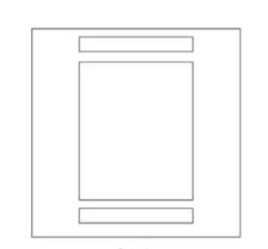
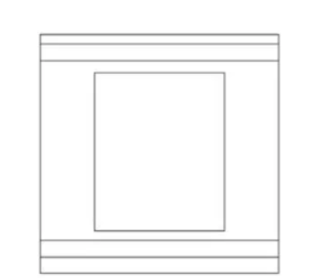
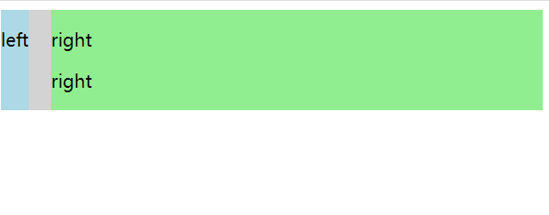
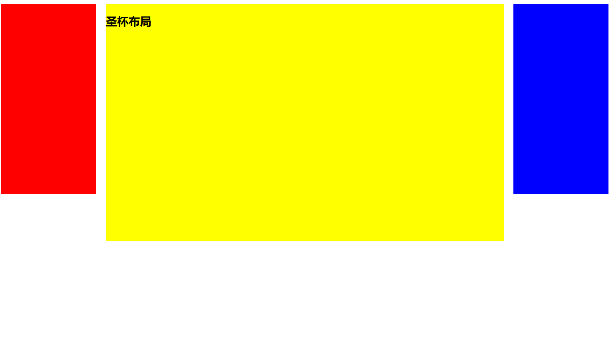
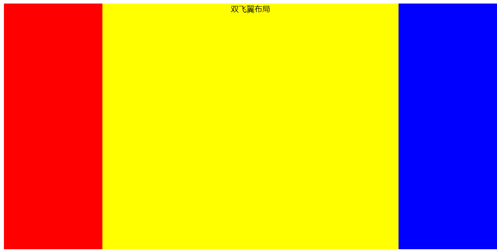

## 单列布局
### header,content和footer等宽的单列布局

实现代码：
```
<!DOCTYPE html>
<html>

<head>
    <title>test</title>
    <meta charset="UTF-8">
    <meta name="viewport" content="width=device-width, initial-scale=1">
    <link href="css/style.css" rel="stylesheet">
    <style>
        .header {
            margin: 0 auto;
            max-width: 960px;
            height: 100px;
            background-color: blue;
        }
        
        .content {
            margin: 0 auto;
            max-width: 960px;
            height: 400px;
            background-color: aquamarine;
        }
        
        .footer {
            margin: 0 auto;
            max-width: 960px;
            height: 100px;
            background-color: aqua;
        }
    </style>
</head>

<body>
    <div class="header"></div>
    <div class="content"></div>
    <div class="footer"></div>

</body>

</html>
```

### header与footer等宽,content略窄的单列布局

实现代码：
```
<!DOCTYPE html>
<html>

<head>
    <title>test</title>
    <meta charset="UTF-8">
    <meta name="viewport" content="width=device-width, initial-scale=1">
    <link href="css/style.css" rel="stylesheet">
    <style>
        .header {
            margin: 0 auto;
            max-width: 960px;
            height: 100px;
            background-color: blue;
        }
        
        .nav {
            margin: 0 auto;
            max-width: 800px;
            background-color: darkgray;
            height: 50px;
        }
        
        .content {
            margin: 0 auto;
            max-width: 800px;
            height: 400px;
            background-color: aquamarine;
        }
        
        .footer {
            margin: 0 auto;
            max-width: 960px;
            height: 100px;
            background-color: aqua;
        }
    </style>
</head>

<body>
    <div class="header">
        <div class="nav"></div>
    </div>
    <div class="content"></div>
    <div class="footer"></div>
</body>

</html>
```
## 两列自适应布局
两列自适应布局是指一列由内容撑开，另一列撑满剩余宽度的布局方式

### float+overflow:hidden
如果是普通的两列布局，浮动+普通元素的`margin`便可以实现，但如果是自适应的两列布局，利用`float+overflow:hidden`便可以实现，这种办法主要通过`overflow`触发BFC,而BFC不会重叠浮动元素。由于设置`overflow:hidden`并不会触发IE6-浏览器的`haslayout`属性，所以需要设置`zoom:1`来兼容IE6-浏览器。具体代码如下：
```
<!DOCTYPE html>
<html>

<head>
    <title>test</title>
    <meta charset="UTF-8">
    <meta name="viewport" content="width=device-width, initial-scale=1">
    <link href="css/style.css" rel="stylesheet">
    <style>
        .parent {
            overflow: hidden;
            zoom: 1;
        }
        
        .left {
            float: left;
            margin-right: 20px;
        }
        
        .right {
            overflow: hidden;
            zoom: 1;
        }
    </style>
</head>

<body>
    <div class="parent" style="background-color: lightgrey;">

        <div class="left" style="background-color: lightblue;">

            <p>left</p>
        </div>

        <div class="right" style="background-color: lightgreen;">

            <p>right</p>

            <p>right</p>
        </div>
    </div>

</body>

</html>
```
### flex布局实现
Flex布局，也叫弹性盒子布局，区区简单几行代码就可以实现各种页面的的布局。
实现代码：
```
<!DOCTYPE html>
<html>

<head>
    <title>test</title>
    <meta charset="UTF-8">
    <meta name="viewport" content="width=device-width, initial-scale=1">
    <link href="css/style.css" rel="stylesheet">
    <style>
        .parent {
            display: flex;
        }
        
        .right {
            margin-left: 20px;
            flex: 1;
        }
    </style>
</head>

<body>
    <div class="parent" style="background-color: lightgrey;">

        <div class="left" style="background-color: lightblue;">

            <p>left</p>
        </div>

        <div class="right" style="background-color: lightgreen;">

            <p>right</p>

            <p>right</p>
        </div>
    </div>

</body>

</html>
```
### grid布局
Grid布局，是一个基于网格的二维布局系统，目的是用来优化用户界面设计。
```
<!DOCTYPE html>
<html>

<head>
    <title>test</title>
    <meta charset="UTF-8">
    <meta name="viewport" content="width=device-width, initial-scale=1">
    <link href="css/style.css" rel="stylesheet">
    <style>
        .parent {
            display: grid;
            grid-template-columns: auto 1fr;
            grid-gap: 20px
        }
    </style>
</head>

<body>
    <div class="parent" style="background-color: lightgrey;">

        <div class="left" style="background-color: lightblue;">

            <p>left</p>
        </div>

        <div class="right" style="background-color: lightgreen;">

            <p>right</p>

            <p>right</p>
        </div>
    </div>

</body>

</html>
```
## 三栏布局
特征：中间列自适应宽度，旁边两侧固定宽度，实现三栏布局有多种方式，着重讲圣杯布局和双飞翼布局。
### 圣杯布局

```
<!DOCTYPE html>
<html>

<head>
    <title>test</title>
    <meta charset="UTF-8">
    <meta name="viewport" content="width=device-width, initial-scale=1">
    <link href="css/style.css" rel="stylesheet">
    <style>
        .container {
            padding-left: 220px;
            padding-right: 220px;
        }
        
        .left {
            float: left;
            width: 200px;
            height: 400px;
            background: red;
            margin-left: -100%;
            position: relative;
            left: -220px;
        }
        
        .center {
            float: left;
            width: 100%;
            height: 500px;
            background: yellow;
        }
        
        .right {
            float: left;
            width: 200px;
            height: 400px;
            background: blue;
            margin-left: -200px;
            position: relative;
            right: -220px;
        }
    </style>
</head>

<body>

    <article class="container">

        <div class="center">

            <h2>圣杯布局</h2>
        </div>

        <div class="left"></div>
        <div class="right"></div>
    </article>


</body>

</html>
```
实现步骤：  
* 三个部分都设定为左浮动，否则左右两边内容上不去，就不可能与中间列同一行。然后设置center的宽度为100%(实现中间列内容自适应)，此时，left和right部分会被挤到下一行  
* 通过设置margin-left为负值让left和right部分回到与center部分同一行  
* 通过设置父容器的padding-left和padding-right，让左右两边留出间隙。这样的空隙，也就是为了到时候，左右界面分别移动到左右边界的分界线，左右界面和中间界面的分界  
* 空隙先预留好了，此时的左右界面还有跟中间界面黏在一块的，我们要让左右界面基于中间界面做移动。通过设置相对定位，设置left和right的值，让左右部分移动到两边。  

但是这样的圣杯布局有缺点：
* center部分的最小宽度不能小于left部分的宽度，否则会left部分掉到下一行
* 如果其中一列内容高度拉长(如下图)，其他两列的背景并不会自动填充。(借助伪等高布局可解决)
#### 解决方法伪等高布局
实现的方法很简单，我们的需求是，所有的列的高度都要一样。但是既然叫做伪等高。是因为，并没有实际设置这三个的列的高度相同。  
我们先设置一个设置一个大数值的`padding-bottom`，再设置相同数值的负的`margin-bottom`，并在包裹这三列的容器container设置`overflow:hidden`把溢出背景切掉。这样就相当于把这三列都以container的高度为主了，但是container的高度是由高度最大的center撑开的，所以以center的高度为主
## 双飞翼布局
同样也是三栏布局，在圣杯布局基础上进一步优化，解决了圣杯布局错乱问题，实现了内容与布局的分离。而且任何一栏都可以是最高栏，不会出问题。

```
<!DOCTYPE html>
<html>

<head>
    <title>test</title>
    <meta charset="UTF-8">
    <meta name="viewport" content="width=device-width, initial-scale=1">
    <link href="css/style.css" rel="stylesheet">
    <style>
        .container {
            min-width: 600px;
            /* 确保中间内容可以显示出来，两倍left宽+right宽 */
            overflow: hidden;
        }
        
        .center,
        .left,
        .right {
               /* 伪等高采取的，跟上面一样 */
            padding-bottom: 10000px;
            margin-bottom: -10000px;
        }
        
        .left {
            float: left;
            width: 200px;
            height: 400px;
            background: red;
            margin-left: -100%;
        }
        
        .center {
            float: left;
            width: 100%;
            height: 500px;
            background: yellow;
        }
        
        .center .inner {
            text-align: center;
            margin: 0 200px;
            /* 新增部分 */
        }
        
        .right {
            float: left;
            width: 200px;
            height: 400px;
            background: blue;
            margin-left: -200px;
        }
    </style>
</head>

<body>

    <article class="container">

        <div class="center">

            <div class="inner">双飞翼布局</div>
        </div>

        <div class="left"></div>
        <div class="right"></div>
    </article>


</body>

</html>
```
实现步骤：  
* 三个部分都设定为左浮动，然后设置center的宽度为100%，此时，left和right部分会跳到下一行
* 通过设置margin-left为负值让left和right部分回到与center部分同一行，此时形状看起来像是已经实现了双飞翼了，但是还不行
* center部分增加一个内层div，并设margin: 0 200px；这层新加的才是真正的center，center需要写的东西在这一层新增的div里面写
  
缺点：多加一层 dom 树节点，增加渲染树生成的计算量。

两种布局实现方式对比:  
* 两种布局方式在实现上也有相同之处，都是让三列浮动，然后通过负外边距形成三列布局
* 两种布局方式的不同之处在于如何处理中间主列的位置：圣杯布局是利用父容器的左、右内边距+两个从列相对定位；双飞翼布局则是在center新增一个内嵌的div，在div里面调整左右外间距等于left,right的宽度。然后在这一层新增的div里面写真正的center的内容
## 参考
推荐阅读：https://blog.csdn.net/VhWfR2u02Q/article/details/84076421
