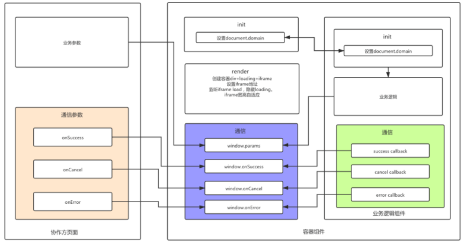

## 背景

现在中台概念算是比较明确的，为了适应不同团队的快速开发，需要提供业务组件给不同的上层业务方使用，但因为一些历史遗留问题，不同业务线使用的框架不统一，包括 jQuery、React 、Vue。为了满足不同业务方的需求，往往需要根据业务方使用的框架，开发对应框架的组件。

这样做不科学，因为每个团队用的技术栈，框架不尽相同，所以维护起来，组件升级都相对比较费劲。

### 理想中的组件

- 跨框架(只需要一套代码适应不同的框架)
- 少升级：组件升级，业务方少升级不升级(注意：组件升级后业务线回归还是必要的)

## 实现方案

1. **原生 js 实现**

<font color=#0000FF >优点：</font>

- 跨框架：不依赖于框架实现
- 轻量：可以不依赖其他 UI 组件，体积小

<font color=#0000FF >缺点：</font>

- 投入产出比低：实现一套常用工具方法和 UI 组件，投入时间长

- 踩坑：兼容性问题的坑要走一遍，风险大

- 很难满足复杂业务场景的需求

<font color=#0000FF >适用场景</font>

不需要复杂交互的场景，如前台吊顶、后台菜单侧边栏可采用这种方式。

但在实际的业务场景中，业务组件中有比较多复杂的交互场景， 上面的方案不太能满足要求，所以我们在上面的方案之上进行迭代：

2. **原生容器组件+iframe 加载业务逻辑组件**

我们把业务组件分成两个部分：

- 容器组件

  用原生 JS 实现中间层容器组件，解决跨框架的加载问题，容器组件主要负责：

  1. 收集组件需要的参数

  2. 注册全局回调

  3. 组件挂载

  4. 加载 iframe

* 业务逻辑组件
  根据 iframe 天然的沙箱特性，业务逻辑用 iframe 页面加载，就保证了业务组件的实现不受框架的限制，可以完美解决问题。业务逻辑组件主要负责：

1.  与容器组件通信

2.  运行环境隔离，可以使用任意框架实现业务逻辑

缺点：

1. 动态加载静态资源，iframe 加载略慢，实际体验在接受范围内

2. 跨域通信问题

此方案容器组件作为中间层，封装不变的逻辑，将多变的业务逻辑隔离出来，从而保证协作方尽量少升级或不升级。业务定制性可根据接口配置，返回不同的 iframe 地址，加载不同的业务逻辑组件，一次开发任意使用。

实现逻辑图：


## 实现

### 容器组件

- 初始化

设置 `document.domain`，让外部组件和 iframe 可以通信

```js
// 获取主域名
function getTopLevelDomain(host) {
  let data = host || window.location.host;
  return data.split(".").slice(-2).join(".");
}
// 设置主域名为外层的顶级域A.com
function setDomainToTopLevelDomain() {
  try {
    window.document.domain = getTopLevelDomain();
  } catch (error) {
    console.error("设置domain失败");
  }
}
```

- render：

生成外部容器 div，设置 loading 图，挂载组件

```js
class Vanilla {
  // 获取配置信息
  constructor(config) {
    const options = { ...defaultConfig, ...config };
    this.options = options;
    this.elCls = options.elCls;
  }
 // 生成容器 div
  render() {
    const div = document.createElement('div');
    this.el = div;

    const { width, height } = this.options;
    div.className = `${prefixCls}-wrap ${prefixCls}-wrap-loading ${this.elCls || ''}`;
    const maskNode = getMaskNode(prefixCls);
    const iframeNode = getIframeNode(prefixCls, width, height);
    div.innerHTML = maskNode + iframeNode;
    document.body.appendChild(div);
    this.fn();
  }
  init() {
    // 设置主域名
    setDomainToTopLevelDomain();
    // 初始化 div
    this.render();
    // 初始化全局回调函数
    this.initCallbacks();
  }
  ...
}
```

- 注册回调函数

通过注册全局回调函数，用于业务逻辑组件与容器组件进行通信

```js
class Vanilla {
 ...
  initCallbacks() {
    const self = this;
    const options = this.options;
     // 初始化全局变量
    window[paramsName] = options;

    window.onSuccess = function onSuccess(data, res) {
      options.onSuccess && options.onSuccess(data, res);
      // 延迟1500ms删除用来显示成功提示
      setTimeout(() => {
        self.removeNode();
      }, 1500);
      self.resetCallbacks && self.resetCallbacks();
    };
    window.onCancel = function onCancel() {
      options.onCancel && options.onCancel();
      self.removeNode();
      self.resetCallbacks && self.resetCallbacks();
    };
    window.onError = function onError(data) {
      options.onError && options.onError(data);
    };
  }
}

```

- 加载 iframe

通过接口获取 iframe 地址，业务方可以根据配置动态，加载不同的业务组件

```js
let timer = function timer() {};
class Vanilla {
  ...
  $mount() {
   ...
   this.fn();
  }
  fn() {
    const {
      width,
      height,
      isAutoSize,
    } = this.options;
    const el = this.el;
    const url = getContentUrl('你的iframe地址');
    const iframeWidth = width;
    const iframeHeight = height;
    const iframeEle = el.querySelector('.J_CreditIframe');
    const modalNode = el.querySelector(`.${prefixCls}`);

    if (!isAutoSize && (iframeWidth !== width || iframeHeight !== height)) {
      this.setNodeSizeAndPostion(modalNode, iframeEle, iframeWidth, iframeHeight);
    }
    iframeEle.setAttribute('src', url);
    // 监听load后，隐藏loading
    addEvent(iframeEle, 'load', () => {
      el.className = `${prefixCls}-wrap ${this.elCls || ''}`;
      const maxTime = 3000;
      const duration = 1000;
      let timerCounter = 0;
      let w = defaultConfig.width;
      let h = defaultConfig.height;
      // 自适应宽高
      if (isAutoSize) {
        timer = setInterval(() => {
          ...
      //
       this.setNodeSizeAndPostion(modalNode, iframeEle, scrollWidth, scrollHeight);
          }
          timerCounter += duration;
          if (timerCounter >= maxTime) {
            clearInterval(timer);
          }
        }, duration);
      }
    });
  }

  // 设置iframe宽高
  setNodeSizeAndPostion(container, iframe, width, height) {
    container.style.cssText = `width: ${width}px; height: ${height}px;margin-left: -${width / 2}px;margin-top: -${height / 2}px;`;
    iframe.style.cssText = `width: ${width}px; height: ${height}px;`;
  }
  // 删除DOM
  removeNode() {
    timer && clearInterval(timer);
    if (this.el) {
      document.body.removeChild(this.el);
    }
  }
  ...
}
```

### 容器组件和业务逻辑组件之间如何通信

```js
// 获取父页面属性
const params = window.parent.paramsName;
// 调用父页面方法
window.parent.onSuccess && window.parent.onSuccess(data);
```

但在实际的业务场景中，我们可能会面临的问题是业务方的域名与 iframe 加载的组件地址域名不一致，这个时候我们就必须要解决组件的跨域通信问题了.

## 跨域通信问题

### postMessage

postMessage (https://developer.mozilla.org/zh-CN/docs/Web/API/Window/postMessage) 可以跨文档通信， 在 IE10 的支持性有问题，在 IE11 及以上可以完美解决跨域问题。笔者需要支持 IE9+，所以没有采用 postMessage

### document.domain

document.domain + iframe : 设置 document.domain 为主域名，业务方与 iframe 主域名相同，实现父子同域通信。这种实现的前提是两个域的主域名必须一致

### Nginx 代理

Nginx 配置：**iframe 页面的路径配置为通用路径**，反向代理依赖接口，实现全域名可访问。将业务逻辑组件整合到一个或多个项目中使用，组件打包和发布逻辑可单独定制，适合大量跨框架组件

```
// 静态页面地址
location ~ ^/your-project/ {
  root /opt/front/your-project/;
  try_files $uri $uri/ /index.html = 404;
  access_log off;
}
// 反向代理
location ~ ^/api/service/(.*)$ {
   proxy_pass http://your-ip;
   proxy_set_header        X-Real-IP $remote_addr;
   proxy_set_header        X-Forwarded-For $proxy_add_x_forwarded_for;
   proxy_set_header        Host $http_host;
   proxy_set_header        requestId $request_id;
   proxy_http_version      1.1;
   proxy_set_header        Connection "";
   expires 30d;
   access_log off;
 }

```

## 需要注意的问题

注意处理非白色背景的圆角部分，容易出现毛边。处理方法是 iframe 容器不设置背景色，由 iframe 里面设置圆角 (`iframe.border="no"`)

版本控制：小版本保证向前兼容，大版本可通过动态获取 iframe 地址来实现版本控制

## 参考

[政采云如何实现跨框架组件](https://mp.weixin.qq.com/s?__biz=MzI0NTE5NzYyMw==&mid=2247484469&idx=1&sn=abac7849a0af0b111769b3f8409bf766&chksm=e9537a6dde24f37b381103c7b15fff7a5f891b7a27fd9f2e31b724e338f258719913aac8ce00&mpshare=1&scene=1&srcid=1020KBeuLhn0RJL8d3QZ78TL&sharer_sharetime=1603160097915&sharer_shareid=f0905f0408effed4fda33087fe9c2205&key=0e6b2ba44e52e4c4ea60974425dec80f0a2fc392b2c8aa37786994eb3ff2d2aafae6c2f92851d839211035c120f7bd722a6ba8e09c40b1bea9a8294f3e36a531faf78a71fe23d77dc87c68d1d2837c94d1db2336c7f2fd7449a7658b3ec517579930cff3a776c0e475bff2bddb9654e6a3e1d6a3d4a97ff39a0bef0539768ab6&ascene=1&uin=MzAzMDM5NTQ4OQ%3D%3D&devicetype=Windows+10+x64&version=6300002f&lang=zh_CN&exportkey=A9kgw8Hp8%2FbOOdBIG4xSMKE%3D&pass_ticket=y1v3BlOnGSb3k2l7X6hvyE53uw5J2PoisBaLtxOU3jm3aLVxeI9lSKAbKCjGVfTV&wx_header=0)
