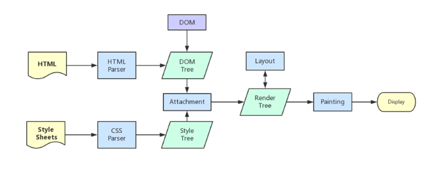

## 从键入url到页面显示发生了什么
这个过程可以大致分为两个部分：网络通信和页面渲染。
### 网络通信
输入url按下回车之后，浏览器会去浏览器缓存中寻找该url的ip；没有的话去系统缓存中找，还是没有的话去路由器缓存中寻找；再没有就去系统host文件中找，还是没有最后只能去请求dns服务器，然后dns给一个ip给浏览器；浏览器根据这个IP地址，向服务器发送HTTP请求。HTTP经过传输层(TCP的三次握手建立连接);网络层(IP协议查询MAC地址);数据链路层(找到对方的MAC地址之后，将数据传送到数据链路层);物理层(传输给服务器);服务器接受数据；服务器响应请求；服务器返回相应的文件(HTML文件等)，接下来就是页面渲染
### 浏览器渲染
* 处理 HTML 并构建 DOM 树。(如果遇到style节点 则构建css树（这里不会阻塞dom树的构建）)
* 处理 CSS 构建 CSSOM 树。
* 将 DOM 与 CSSOM 合并成一个渲染树。
* 根据渲染树来布局，计算每个节点的位置。
* 调用 GPU 绘制，合成图层，显示在屏幕上。



在构建 CSSOM 树时，会阻塞渲染，直至 CSSOM 树构建完成。并且构建 CSSOM 树是一个十分消耗性能的过程，所以应该尽量保证层级扁平，减少过度层叠，越是具体的 CSS 选择器，执行速度越慢

#### 浏览器渲染阻塞  
当 HTML 解析到 script 标签时，会暂停构建 DOM，完成后才会从暂停的地方重新开始。也就是说，如果你想首屏渲染的越快，就越不应该在首屏就加载 JS 文件。并且 CSS 也会影响 JS 的执行，只有当解析完样式表才会执行 JS，所以也可以认为这种情况下，CSS 也会暂停构建 DOM。 
为了避免解析到script标签的时候就发生浏览器渲染阻塞，我们可以给script标签加上async或者defer属性，这两个属性使得script标签不会阻塞DOM的渲染，**能够异步加载script脚本，不阻塞DOM渲染。**

##### defer
如果`script`标签设置了该属性，浏览器则会异步地下载该文件并且不会影响到后续DOM的渲染。如果有多个设置了`defer`的`script`标签存在，则会按照顺序执行所有的script。（defer按script脚本的声明顺序执行）
```
<script defer type="text/javascript" src="/script2
.js">/<script>
<script defer type="text/javascript" src="/script1
.js">/<script>
```
#### async
`async`的设置，会使得script脚本异步加载。`async`的执行，不会按照script在页面中的顺序来执行，而是谁先加载完谁执行（此处与defer有所不同）。
```
<script async type="text/javascript" src="/script2
.js">/<script>
<script async type="text/javascript" src="/script1
.js">/<script>
```

对于`link`标签和`@import`,这是引入CSS的两种方式，当解析HTML解析到`Link`标签时，会同步加载CSS文件，浏览器会多开一个线程，而`@import`，会等页面构建完，也就是加载完HTML文件之后再加载这个CSS文件。`link`标签的优先级比`@import`高
#### DOM树与渲染树
 DOM树是由HTML文件中的标签排列组成，渲染树是在DOM树中加入CSS或HTML中的style样式而形成。渲染树只包含需要显示在页面中的DOM元素，像`<head>`元素或`display`属性值为`none`的元素都不在渲染树中。

 ## 回流和重绘
 重绘和回流是渲染步骤中的一小节，但是这两个步骤对于性能影响很大。

 * 重绘是当节点需要更改外观而不会影响布局的，比如改变  `color `就叫称为重绘
 * 回流是布局或者几何属性需要改变就称为回流

 回流必定会发生重绘，重绘不一定会引发回流。回流所需的成本比重绘高的多，改变深层次的节点很可能导致父节点的一系列回流。

 ### 减少回流和重绘
 * 使用 `translate` 替代`top`
 ```
 <div class="test"></div>
<style>
  .test {
    position: absolute;
    top: 10px;
    width: 100px;
    height: 100px;
    background: red;
  }
</style>
<script>
  setTimeout(() => {
    // 引起回流
    document.querySelector('.test').style.top = '100px'
  }, 1000)
</script>
```
* 使用 `visibility `替换 `display: none `，因为前者只会引起重绘，后者会引发回流（改变了布局）
* 把 DOM 离线后修改，比如：先把 DOM 给 display:none (有一次 Reflow)，然后你修改 100 次，然后再把它显示出来
* 不要把 DOM 结点的属性值放在一个循环里当成循环里的变量
```
for (let i = 0; i < 1000; i++) {
  // 获取 offsetTop 会导致回流，因为需要去获取正确的值
  console.log(document.querySelector('.test').style.offsetTop)
}
```
* 不要使用` table` 布局，可能很小的一个小改动会造成整个 `table `的重新布局
* 动画实现的速度的选择，动画速度越快，回流次数越多，也可以选择使用 `requestAnimationFrame`
* CSS 选择符从右往左匹配查找，避免 DOM 深度过深,　css选择器的嵌套层级最好不要超过三级
* 将频繁运行的动画变为图层，图层能够阻止该节点回流影响别的元素。比如对于` video `标签，浏览器会自动将该节点变为图层。

## 图层
一般来说，可以把普通文档流看成一个图层。特定的属性可以生成一个新的图层。**不同的图层渲染互不影响**，所以对于某些频繁需要渲染的建议单独生成一个新图层，提高性能。**但也不能生成过多的图层，会引起反作用。**
通过以下几个常用属性可以生成新图层

* 3D 变换：`translate3d`、`translateZ`
* `will-change`
* `video`、`iframe` 标签
* 通过动画实现的 `opacity` 动画转换
* `position: fixed`
