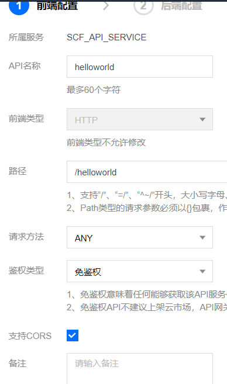
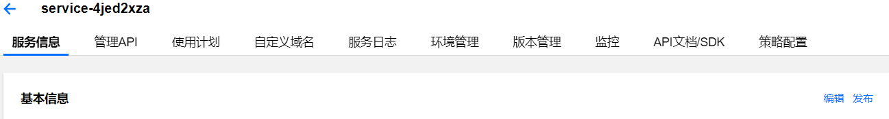

## 前言
最近在做一个小程序项目，有些接口需要自己实现，作为前端开发人员，对服务器方面一窍不通，所以发现了腾讯云可以提供云开发和云函数(SCF)来实现一站式部署。  
SCF简而言之，就是自己写好接口代码，放在腾讯云上，腾讯云暴露一个api给你使用。而我主要讲一下使用vscode创建云函数的过程。因为刚好代码之类的也是可以在vscode写的。

## 创建
[详情可以参考官方文档vscode创建云函数](https://cloud.tencent.com/document/product/583/37511)

但是有几个有点模糊的点我补充一下。
* 根据提示依次输入账号的 APPID，SecretId 及 SecretKey 信息，作为插件调用云 API 时的认证信息。这里的账号，是我们需要自己新建的角色`QCS_SCFExcuteRole `并且要进行权限的配置，然后才可以看到对应的APPID，SecretId 及 SecretKey
* 然后在vscode本地调试代码运行的时候，选择的是api网关模板

## 部署
当我们vscode本地上传函数到云端时，我们会在自己的腾讯云函数服务控制台看到我们上传的函数，但是有些地方需要做一些更改。  
在SCF控制台（云函数控制台），点击我们创建的云函数，点击触发方式，点击api服务名，跳转到`api网关服务控制台`，选择管理API，点击编辑操作，在前端配置栏**开启CORS**,解决后面调用窗口的**跨域问题**。
 
然后完成后续配置操作之后，我们需要把api再**发布一次，发布一次，发布一次**，然后api便可以正常访问了。
 