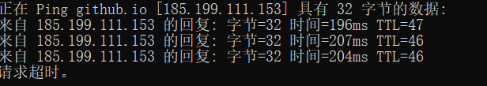
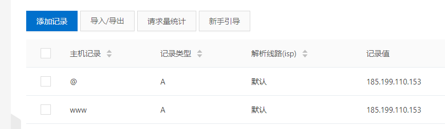

## 前言
从开始搭建到完成，断断续续，毕竟自己也是照着别人的文章和官方文档再做，结果变成了搭建完，先优化主题，最后才开始写这篇博客。这其中还是有些坑需要记录一下
## 第一步 准备工作
首先确保自己的node.js已经安装好，而且环境变量配置好，有自己个人的github账户。
接着在github上新建一个repository，命名为：你的github名称.github.io(下面是我的仓库名称)
``` bash
 yinjiangqaq.github.io
```

## 第二步 安装hexo 
hexo其实就是一个博客框架，方便我们建站的一个框架。官网也有安装教程[Hexo](https://hexo.io/)

### step1：
Windows系统的话，可以不在系统盘，可以选择D盘，然后鼠标右键git bash，输入两个安装指令：
``` bash
 npm install hexo-cli -g   //用于全局安装hexo
npm install hexo-deployer-git --save   //用于安装hexo部署到git page的deployer
```
### step2： 新建一个hexo文件夹
在D盘新建一个名为hexo的文件夹，然后再次鼠标右键git bash，输入两个指令
``` bash
hexo init  //安装 hexo相关的包
npm install   //安装node_modules和所有package.json里的包
```
执行这两个指令完成之后，你会看到你的hexo文件夹多了一些文件，这时候如果你想看本地效果的话，可以执行如下指令：
``` bash
hexo generate  //自动将md文件生成静态html，css文件
hexo server  //启动本地hexo服务器（localhost:4000）
```
然后打开浏览器访问localhost:4000，便可以看到自己建立博客页面了

## 第三步 了解hexo文件夹中_config.yml文件
hexo文件夹中比较重要的文件是：_config.yml，这是一个全局配置文件。
### step1：
执行命令，安装deploy.git插件
``` bash
npm install hexo-deployer-git --save
```
### step2： 
打开这个文件，修改一下下面这部分(在配置文件的最后)，让自己的本地项目和远程仓库通过 git  建立连接部署
``` bash
# Deployment
## Docs: https://hexo.io/docs/deployment.html
deploy:
   type: git
   repository: https://github.com/yinjiangqaq/yinjiangqaq.github.io.git
   branch: master
```
### step3：
配置提交github认证方式
执行指令：
``` bash
hexo d
```
直接提交到远程你自己之前创建的github仓库，如果没有认证github和本地的关系，会提示你输入用户名和密码，输入完成之后，就会发现除了在.gitignore中出现的默认不推上去的文件之后，其他文件都推到了远程的github仓库

## 第五步 添加域名
阿里云中买一个.com的域名(域名价格纯看你的自己想起的名字，反正我的不知不觉就贵了，还享受不到优惠....)
这其中省略了你要注册阿里云账号，实名认证之类的步骤
### step1 cmd ping 一下 github.io，获得真是ip地址
 
### step2：
然后再域名操作栏点击解析，添加记录

记得需要添加两个记录，只添加www不知道为啥显示不出来

### step3:
去hexo文件夹的source目录下新建一个名为CNAME的文件，添加文件内容为你刚才购买的域名，不要添加www，内容添加如下：

``` bash
yinjiangqaq.com
```
### step4：
然后部署,power shell输入
``` bash
hexo clean  //清除上次的缓存
hexo generate //生成
hexo deploy //部署
```
(每次做出大一点的更改都建议部署一次)


### step5:
如果之前注册域名的时候，有进行过实名认证，那部署成功之后，打开浏览器输入你的域名，便可以看到你的个人博客了

## 关于主题优化

推荐一些已经很完善的博客，我也是借鉴其中的：
[hexo深度优化](https://io-oi.me/tech/hexo-next-optimization/#%E5%BF%85%E8%AF%BB-%E5%86%99%E5%9C%A8%E5%89%8D%E9%9D%A2)
[hexo主题个性化设置](https://blog.csdn.net/zgcr654321/article/details/86751765)